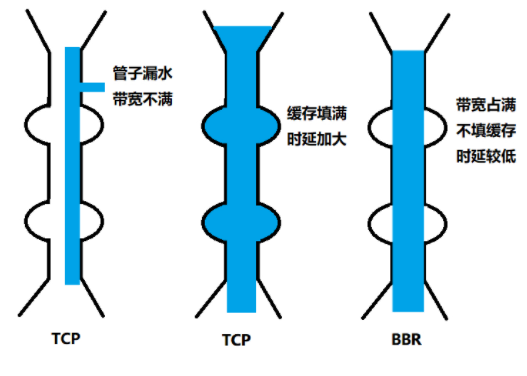
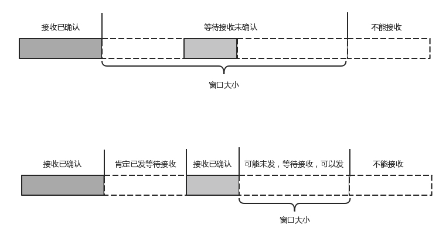
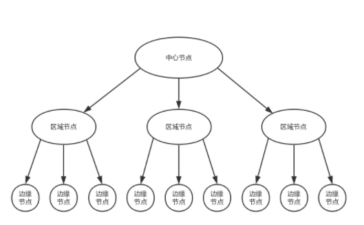
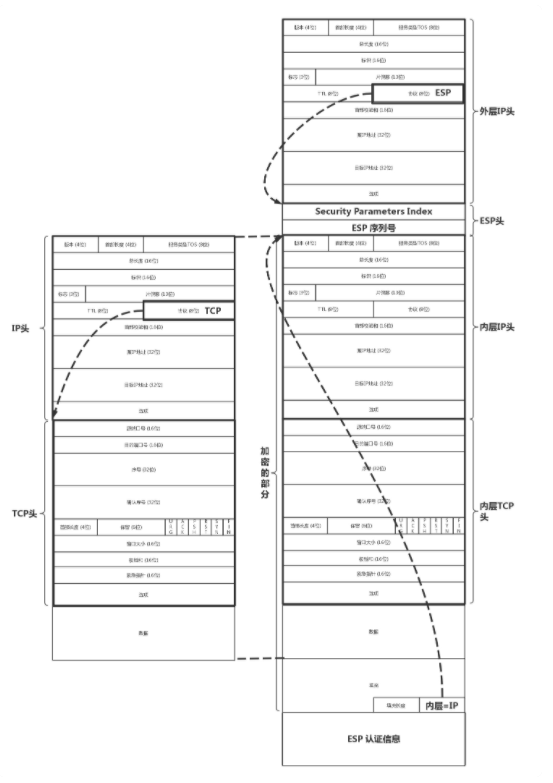
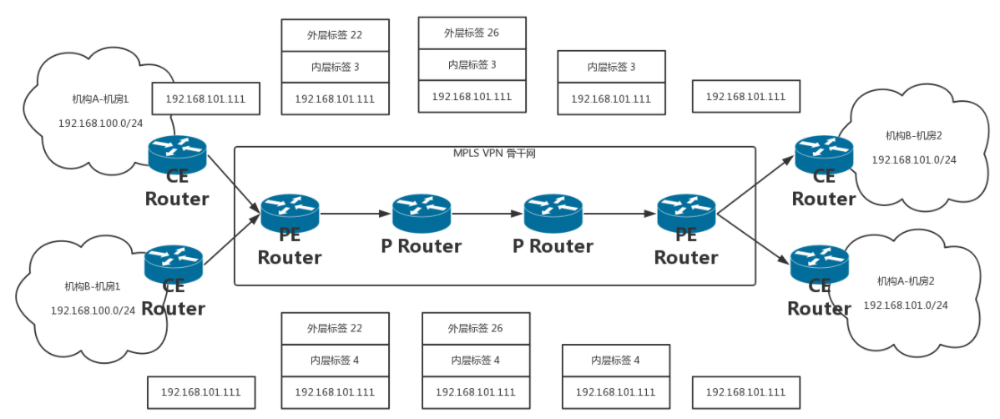
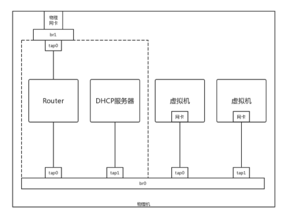
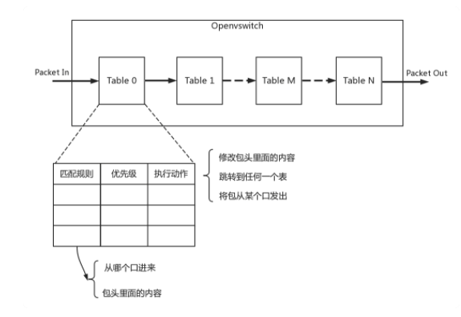
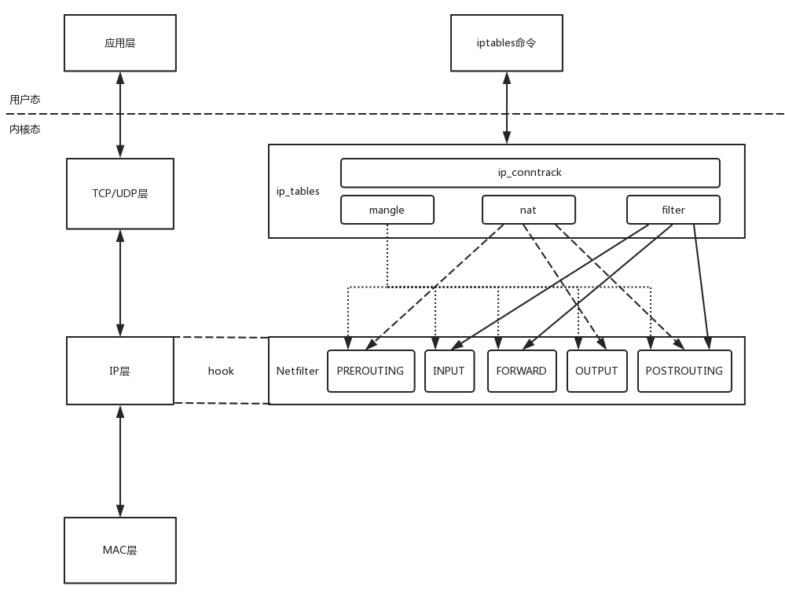
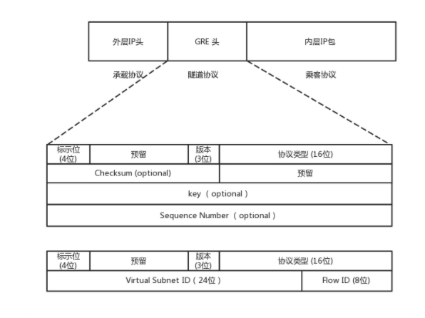

# 网络协议


## 1. 通信协议

### 1.1 网络协议构成

**应用层**： 在浏览器里面输入 https://www.kaola.com ，这是一个 URL。浏览器只知道名字是“www.kaola.com”。可以使用DNS或者HTTPDNS。无论用哪一种方法查找，最终都会得到这个地址：**106.114.138.24。这个是 IP 地址，是互联网世界的“门牌号”。** DNS、HTTP、HTTPS 所在的层我们称为应用层。


**传输层：**经过应用层封装后，浏览器会将应用层的包交给下一层去完成，通过 socket 编程来实现。下一层是传输层。传输层有两种协议，一种是无连接的协议 UDP，一种是面向连接的协议 TCP。TCP 协议里面会有两个端口，一个是浏览器监听的端口，一个是电商的服务器监听的端口。操作系统往往通过端口来判断，它得到的包应该给哪个进程。


**网络层：**传输层封装完毕后，浏览器会将包交给操作系统的网络层。网络层的协议是 IP 协议。在 IP 协议里面会有源 IP 地址，即浏览器所在机器的 IP 地址和目标 IP 地址，也即电商网站所在服务器的 IP 地址。


**链路层：**操作系统知道要离开本地去远方，去外地就要去网关。操作系统大吼一声，谁是 192.168.1.1 啊。网关会回答，**这个本地地址就是 MAC 地址，而大吼的那一声是 ARP 协议。**网关收到包之后，会根据自己的知识，判断下一步应该怎么走。**网关往往是一个路由器，到某个 IP 地址应该怎么走，这个叫作路由表。**


网关之间相互沟通，这种沟通的协议称为路由协议，**常用的有 OSPF 和 BGP**。最后一个网关知道这个网络包要去的地方就问谁是目标 IP 啊？**目标服务器就会回复一个 MAC 地址。网络包过关后，通过这个 MAC 地址就能找到目标服务器**。

目标服务器发现 MAC 地址对上了，取下 MAC 头来，发送给操作系统的网络层。发现 IP 也对上了，就取下 IP 头。IP 头里会写上一层封装的是 TCP 协议，然后将其交给传输层，即 TCP 层。


在这一层里，对于收到的每个包，**都会有一个回复的包说明收到了**。而仅仅是 TCP 层的一个说明，即收到之后的回复。当然这个回复，会沿着刚才来的方向走回去，报个平安


### 1.2 网络分层


#### 网络包接收

调用 process_layer2(buffer)，摘掉二层的头，看一看，应该根据头里面的内容做什么操作。假设你发现这个包的 MAC 地址和你的相符，那说明就是发给你的，于是需要调用 process_layer3(buffer)。

调用 process_layer3(buffer)，摘掉三层的头，看看到底是发送给自己的，还是希望自己转发出去的。如果 IP 地址不是自己的，那就应该转发出去；如果 IP 地址是自己的，那就是发给自己的。根据 IP 头里面的标示，拿掉三层的头，进行下一层的处理，到底是调用process_tcp(buffer) 呢，还是调用 process_udp(buffer) 呢

调用 process_tcp(buffer)，就需要查看四层的头，看这是一个发起，还是一个应答，又或者是一个正常的数据包，然后分别由不同的逻辑进行处理。如果是发起或者应答，接下来可能要发送一个回复包；如果是一个正常的数据包，就需要交给应用层处理


#### 网络包发送

调用 send_tcp(buffer)。不用说，Buffer 里面就是 HTTP 请求的内容。这个函数里面加一个 TCP 的头，记录下源端口号。浏览器会给你目的端口号，一般为 80 端口。

调用 send_layer3(buffer)。在这个函数里面加一个 IP 的头，记录下源 IP 的地址和目标 IP 的地址。

然后调用 send_layer2(buffer)。这个函数里面要加一下 MAC 的头，记录下源 MAC 地址，得到的就是本机器的 MAC 地址和目标的 MAC 地址。


### 1.3 IP地址和MAC地址

运行一下 ip addr

```shell
root@test:~# ip addr
1: lo: <LOOPBACK,UP,LOWER_UP> mtu 65536 qdisc noqueue state UNKNOWN group default 
    link/loopback 00:00:00:00:00:00 brd 00:00:00:00:00:00
    inet 127.0.0.1/8 scope host lo
       valid_lft forever preferred_lft forever
    inet6 ::1/128 scope host 
       valid_lft forever preferred_lft forever
2: eth0: <BROADCAST,MULTICAST,UP,LOWER_UP> mtu 1500 qdisc pfifo_fast state UP group default qlen 1000
    link/ether fa:16:3e:c7:79:75 brd ff:ff:ff:ff:ff:ff
    inet 10.100.122.2/24 brd 10.100.122.255 scope global eth0
       valid_lft forever preferred_lft forever
    inet6 fe80::f816:3eff:fec7:7975/64 scope link 
       valid_lft forever preferred_lft foreverxxxxxxxxxx 08:00:27:07:e9:ae brd ff:ff:ff:ff:ffroot@test:~# ip addr1: lo: <LOOPBACK,UP,LOWER_UP> mtu 65536 qdisc noqueue state UNKNOWN group default     link/loopback 00:00:00:00:00:00 brd 00:00:00:00:00:00    inet 127.0.0.1/8 scope host lo       valid_lft forever preferred_lft forever    inet6 ::1/128 scope host        valid_lft forever preferred_lft forever2: eth0: <BROADCAST,MULTICAST,UP,LOWER_UP> mtu 1500 qdisc pfifo_fast state UP group default qlen 1000    link/ether fa:16:3e:c7:79:75 brd ff:ff:ff:ff:ff:ff    inet 10.100.122.2/24 brd 10.100.122.255 scope global eth0       valid_lft forever preferred_lft forever    inet6 fe80::f816:3eff:fec7:7975/64 scope link        valid_lft forever preferred_lft forever
```

本来 32 位的 IP 地址就不够，还被分成了 5 类。

C 类地址能包含的最大主机数量实在太少了，只有 254 个。当时设计的时候恐怕没想到，现在估计一个网吧都不够用吧。而 B 类地址能包含的最大主机数量又太多了。6 万多台机器放在一个网络下面，一般的企业基本达不到这个规模。


#### 无类型域间选路（CIDR）

于是有了一个折中的方式叫作无类型域间选路，简称 CIDR。这种方式打破了原来设计的几类地址的做法，将 32 位的 IP 地址一分为二，前面是网络号，后面是主机号。10.100.122.2/24，这个 IP 地址中有一个斜杠，斜杠后面有个数字 24。这种地址表示形式，就是 CIDR。**后面 24 的意思是，32 位中，前 24 位是网络号，后 8 位是主机号。**

一个是广播地址，10.100.122.255。如果发送这个地址，所有 10.100.122 网络里面的机器都可以收到。另一个是子网掩码，255.255.255.0。**将子网掩码和 IP 地址按位计算 AND，就可得到网络号。**

16.158.165.91/22 这个 CIDR。16.158 的部分不会动，它占了前 16 位。中间的 165，**变为二进制为‭10100101**‬。除了前面的 16 位，还剩 6 位。所以，这 8 位中前 6 位是网络号，16.158.<101001>，而 <01>.91 是机器号。

**地址范围是16.158.<101001><00>.1 至 16.158.<101001><11>.255。16.158.<101001><11>.255 是广播地址，子网掩码是 255.255.<111111><00>.0**


#### MAC 地址

一个网络包要从一个地方传到另一个地方，除了要有确定的地址，还需要有定位功能。 而有门牌号码属性的 IP 地址，才是有远程定位功能的。

**MAC 地址更像是身份证，是一个唯一的标识。**它的唯一性设计是为了组网的时候，不同的网卡放在一个网络里面的时候，可以不用担心冲突。从硬件角度，保证不同的网卡有不同的标识。

MAC 地址的通信范围比较小，局限在一个子网里面。一旦跨子网，即从 192.168.0.2/24 到 192.168.1.2/24，MAC 地址就不行了，需要 IP 地址起作用了。


#### 网络设备的状态标识

**<BROADCAST,MULTICAST,UP,LOWER_UP> 叫做 net_device flags**，网络设备的状态标识。

+ UP 表示网卡处于启动的状态；
+ BROADCAST 表示这个网卡有广播地址，可以发送广播包；
+ MULTICAST 表示网卡可以发送多播包；
+ LOWER_UP 表示 L1 是启动的，也即网线插着呢。
+ MTU1500 是指最大传输单元 MTU 为 1500，这是以太网的默认值。


**qdisc 全称是 queueing discipline，中文叫排队规则**

+ 最简单的是 pfifo，它不对进入的数据包做任何的处理，数据包采用先入先出的方式通过队列。
+ pfifo_fast 稍微复杂一些，它的队列包括三个波段（band）。在每个波段里面，使用先进先出规则。三个波段（band）的优先级也不相同。band 0 的优先级最高，band 2 的最低。如果 band 0 里面有数据包，系统就不会处理 band 1 里面的数据包。


### 1.4 DHCP

如果是数据中心里面的服务器，IP 一旦配置好，基本不会变，这就相当于买房自己装修。DHCP 的方式就相当于租房。你不用装修，都是帮你配置好的。

#### 工作方式

新来的机器使用 IP 地址 0.0.0.0 发送了一个广播包，目的 IP 地址为 255.255.255.255。广播包封装了 UDP，UDP 封装了 BOOTP。其实 DHCP 是 BOOTP 的增强版，我们称为 **DHCP Discover。**


DHCP Server 的话根据MAC 地址唯一确定是新的设备，需要租给它一个 IP 地址，这个过程我们称为 **DHCP Offer**。DHCP Server 回复说，我分配了一个可用的 IP 给你


新的设备会选择其中一个 DHCP Offer，并且会向网络发送一个 DHCP Request 广播数据包，包中包含客户端的 MAC 地址、接受的租约中的 IP 地址、提供此租约的 DHCP 服务器地址等，并告诉所有 DHCP Server 它将接受哪一台服务器提供的 IP 地址。


当 DHCP Server 接收到客户机的 DHCP request 之后，会广播返回给客户机一个 DHCP ACK 消息包，表明已经接受客户机的选择，并将这一 IP 地址的合法租用信息和其他的配置信息都放入该广播包，发给客户机


#### IP 地址的收回和续租

客户机会在租期过去 50% 的时候，直接向为其提供 IP 地址的 DHCP Server 发送 DHCP request 消息包。客户机接收到该服务器回应的 DHCP ACK 消息包，会根据包中所提供的新的租期以及其他已经更新的 TCP/IP 参数，更新自己的配置


#### 预启动执行环境（Pre-boot Execution Environment）

PXE 协议分为客户端和服务器端，由于还没有操作系统，**只能先把客户端放在 BIOS 里面。**当计算机启动时，BIOS 把 PXE 客户端调入内存里面，就可以连接到服务端做一些操作了。

DHCP Server 是需要配置的 next-server，指向 PXE 服务器的地址，另外要配置初始启动文件 filename。

```JSON
ddns-update-style interim;
ignore client-updates;
allow booting;
allow bootp;
subnet 192.168.1.0 netmask 255.255.255.0
{
option routers 192.168.1.1;
option subnet-mask 255.255.255.0;
option time-offset -18000;
default-lease-time 21600;
max-lease-time 43200;
range dynamic-bootp 192.168.1.240 192.168.1.250;
filename "pxelinux.0";
next-server 192.168.1.180;
}
```


启动 PXE 客户端。第一步是通过 DHCP 协议告诉 DHCP Server。DHCP Server 便租给它一个 IP 地址，同时也给它 PXE 服务器的地址、启动文件 **pxelinux.0。**


PXE 客户端知道要去 PXE 服务器下载这个文件后，就可以初始化机器。于是便开始下载，下载的时候使用的是 TFTP 协议。所以 PXE 服务器上，往往还需要有一个 TFTP 服务器。


PXE 客户端向 TFTP 服务器请求下载这个文件，TFTP 服务器就将这个文件传给它。然后，PXE 客户端收到这个文件后，就开始执行这个文件。**这个文件会指示 PXE 客户端，向 TFTP 服务器请求计算机的配置信息 pxelinux.cfg。**TFTP 服务器会给 PXE 客户端一个配置文件，里面会说内核在哪里、initramfs 在哪里。PXE 客户端会请求这些文件。


## 2. 网络基础知识

### 2.1 物理层

电脑连电脑， 一头插在一台电脑的网卡上，另一头插在另一台电脑的网卡上。两台电脑已经构成了一个最小的局域网，也即 LAN。

Hub 的东西，也就是集线器。这种设备有多个口，可以将多台电脑连接起来。它完全在物理层工作。它会将自己收到的每一个字节，都复制到其他端口上去。


### 2.2 数据链路层

数据链路层，也即 MAC 层要解决的问题。**MAC 的全称是 Medium Access Control，即媒体访问控制**


#### 信号发送规则

其实就是控制在往媒体上发数据的时候，谁先发、谁后发的问题。防止发生混乱。

+ **信道划分**：分多个车道。每个车一个车道，你走你的，我走我的。
+ **轮流协议**：今天单号出行，明天双号出行，轮着来。
+ **随机接入协议**：有事儿先出门，发现特堵，就回去。错过高峰再出。**著名的以太网，用的就是这个方式。**


#### 数据包格式

解决谁发送，谁接收


对于以太网，第二层的最开始，就是目标的 MAC 地址和源的 MAC 地址。类型，大部分的类型是 IP 数据包，然后 IP 里面包含 TCP、UDP，以及 HTTP 等，这都是里层封装的事情。


#### 数据验证

CRC，也就是循环冗余检测。通过 XOR 异或的算法，来计算整个包是否在发送的过程中出现了错误


#### ARP协议

已知IP地址求MAC地址


#### 交换机 Switch

一台 MAC1 电脑将一个包发送给另一台 MAC2 电脑，当这个包到达交换机的时候，一开始交换机也不知道 MAC2 的电脑在哪个口，所以它只能将包转发给除了来的那个口之外的其他所有的口。**但是交换机会记住MAC1 是来自一个明确的口。以后有包的目的地址是 MAC1 的，直接发送到这个口就可以了, 这就是转发表。**


#### 拓扑结构

交换机肯定不够用，需要多台交换机，交换机之间连接起来，就形成一个稍微复杂的拓扑结构。我们先来看两台交换机的情形。两台交换机连接着三个局域网，每个局域网上都有多台机器。


##### 环路问题


机器 1 的广播包到达交换机 A 和交换机 B 的时候，本来两个交换机都学会了机器 1 是在局域网一的，**但是当交换机 A 将ARP ACK包广播到局域网二之后**，交换机 B 右边的网口收到了来自交换机 A 的广播包。**根据学习机制，这彻底损坏了交换机 B 的三观，刚才机器 1 还在左边的网口呢，怎么又出现在右边的网口呢， 循环往复。**


##### Spanning Tree Protocol


在 STP 协议里面有很多概念

+ **Root Bridge**，也就是根交换机。
+ **Designated Bridges**，有的翻译为指定交换机。可以想像成一个“小弟”。
+ **Bridge Protocol Data Units （BPDU）** ，网桥协议数据单元。可以比喻为“相互比较实力”的协议。**BPDU 只有掌门能发，已经隶属于某个掌门的交换机只能传达掌门的指示**。
+ **Priority Vector**，优先级向量，就是一组 ID 数目，[Root Bridge ID, Root Path Cost, Bridge ID, and Port ID]


Root Bridge 进行合并

+ 不同Root Bridge： **比较Root Bridge ID, 越小优先级越高**
+ 在一个Root Bridge下
  + Root Bridge 和 Designated Bridges： Designated Bridges 更新 Root Path Cost
  + Designated Bridges 和 Designated Bridges： Designated Bridges 比较 Root Path Cost
+ 不同Root Bridge
  + Root Bridge 和 Designated Bridges： 比较 Root Bridge ID
  + Designated Bridges 和 Designated Bridges： 比较格子Root Bridge ID


#### 虚拟局域网

解决广播的安全信息隔离， 原来的二层的头上加一个 TAG，里面有一个 VLAN ID，一共 12 位。


换机是支持 VLAN 的，当这个交换机把二层的头取下来的时候，就能够识别这个 VLAN ID。这样只有相同 VLAN 的包，才会互相转发，不同 VLAN 的包，是看不到的。这样广播问题和安全问题就都能够解决了。


### 2.3 网络层

#### ICMP协议

ICMP 全称 Internet Control Message Protocol，就是互联网控制报文协议。ICMP 报文是封装在 IP 包里面的


##### 查询报文类型

**ICMP ECHO REQUEST**： 一种主动请求，并且获得主动应答的 ICMP 协议

**ICMP ECHO REPLY**：多了两个字段，一个是标识符 ICMP查询类型，另一个是序号，你派出去的侦查兵，都要编个号


##### 差错报文类型

终点不可达

+ 网络不可达
+ 主机不可达
+ 协议不可达
+ 端口不可达
+ 需要分片

源站抑制：让源站放慢发送速度

时间超时：超过网络包的生存时间还是没到

路由重定向：让下次发给另一个路由器


##### ping


ICMP 数据包内包含多个字段。

+ **类型**: **请求数据包是 8， 回复数据包是0**
+ 顺序号，主要用于区分连续 ping 的时候发出的多个数据包。每发出一个请求数据包，顺序号会自动加 1


当遇到网络不通的问题的时候，通过 tcpdump -i eth0 icmp，查看包有没有到达某个点。

```SHELL
➜  ~ tcpdump -i en0 icmp
tcpdump: verbose output suppressed, use -v or -vv for full protocol decode
listening on en0, link-type EN10MB (Ethernet), capture size 262144 bytes
23:34:18.902716 IP 192.168.1.102 > 172.217.194.99: ICMP echo request, id 37669, seq 0, length 64
23:34:18.909557 IP 172.217.194.99 > 192.168.1.102: ICMP echo reply, id 37669, seq 0, length 64
23:34:19.903276 IP 192.168.1.102 > 172.217.194.99: ICMP echo request, id 37669, seq 1, length 64
23:34:19.912920 IP 172.217.194.99 > 192.168.1.102: ICMP echo reply, id 37669, seq 1, length 64
23:34:20.903844 IP 192.168.1.102 > 172.217.194.99: ICMP echo request, id 37669, seq 2, length 64
23:34:20.910938 IP 172.217.194.99 > 192.168.1.102: ICMP echo reply, id 37669, seq 2, length 64
23:34:21.905690 IP 192.168.1.102 > 172.217.194.99: ICMP echo request, id 37669, seq 3, length 64
23:34:21.911117 IP 172.217.194.99 > 192.168.1.102: ICMP echo reply, id 37669, seq 3, length 64
23:34:22.905628 IP 192.168.1.102 > 172.217.194.99: ICMP echo request, id 37669, seq 4, length 64
23:34:22.913086 IP 172.217.194.99 > 192.168.1.102: ICMP echo reply, id 37669, seq 4, length 64
23:34:23.910042 IP 192.168.1.102 > 172.217.194.99: ICMP echo request, id 37669, seq 5, length 64
23:34:23.920326 IP 172.217.194.99 > 192.168.1.102: ICMP echo reply, id 37669, seq 5, length 64
23:34:24.914242 IP 192.168.1.102 > 172.217.194.99: ICMP echo request, id 37669, seq 6, length 64
```


##### Traceroute：差错报文类型的使用

Traceroute 的第一个作用就是故意设置特殊的 Time To Live，来追踪去往目的地时沿途经过的路由器

如果中间的路由器不止一个，当然碰到第一个就“牺牲”。于是，**返回一个 ICMP 包，也就是网络差错包，类型是时间超时**。接下来，将 TTL 设置为 2。第一关过了，第二关就“牺牲”了，那我就知道第二关有多远。如此反复，直到到达目的主机

Traceroute 程序会发送一份 UDP 数据报给目的主机，但它会选择一个不可能的值作为 UDP 端口号（大于 30000）。当该数据报到达时，将使目的主机的 UDP 模块产生一份“端口不可达”错误 ICMP 报文。

```shell
➜  ~ traceroute www.google.com
traceroute: Warning: www.google.com has multiple addresses; using 172.217.194.99
traceroute to www.google.com (172.217.194.99), 64 hops max, 52 byte packets
 1  singtel-acplus (192.168.1.254)  6.140 ms  5.183 ms  4.305 ms
 2  bb219-74-115-254.singnet.com.sg (219.74.115.254)  6.770 ms  4.194 ms  3.532 ms
 3  202.166.123.134 (202.166.123.134)  5.546 ms  4.899 ms  5.700 ms
 4  202.166.123.133 (202.166.123.133)  4.342 ms  5.760 ms  5.130 ms
 5  ae8-0.tp-cr03.singnet.com.sg (202.166.122.50)  7.463 ms  5.876 ms  5.277 ms
 6  ae4-0.tp-er03.singnet.com.sg (202.166.123.70)  6.476 ms  5.374 ms  6.097 ms
 7  203.208.191.197 (203.208.191.197)  6.466 ms
    203.208.191.113 (203.208.191.113)  5.531 ms  6.991 ms
 8  72.14.210.137 (72.14.210.137)  8.493 ms  7.947 ms  4.143 ms
 9  74.125.242.34 (74.125.242.34)  5.186 ms
    108.170.240.172 (108.170.240.172)  6.194 ms
    74.125.242.35 (74.125.242.35)  5.176 ms
10  216.239.35.174 (216.239.35.174)  5.770 ms
    216.239.57.50 (216.239.57.50)  5.798 ms
    72.14.235.152 (72.14.235.152)  6.958 ms
11  74.125.253.62 (74.125.253.62)  7.955 ms
    209.85.242.109 (209.85.242.109)  7.478 ms
    209.85.253.230 (209.85.253.230)  6.570 ms
12  209.85.246.17 (209.85.246.17)  7.729 ms
    209.85.246.15 (209.85.246.15)  9.310 ms
    209.85.246.19 (209.85.246.19)  7.663 ms
```


#### 网关 Gateway


**如果是同一个网段**，直接将源地址和目标地址放入 IP 头中，然后通过 ARP 获得 MAC 地址，将源 MAC 和目的 MAC 放入 MAC 头中，发出去就可以了。

**如果不是同一网段**，这就需要发往默认网关 Gateway。Gateway 的地址一定是和源 IP 地址是一个网段的。例如 192.168.1.0/24 这个网段，Gateway 往往会是 192.168.1.1/24 或者 192.168.1.2/24。

网关往往是一个路由器，是一个三层转发的设备。路由器是一台设备，它有五个网口或者网卡，相当于有五只手，**分别连着五个局域网。每只手的 IP 地址都和局域网的 IP 地址相同的网段**，每只手都是它握住的那个局域网的网关。


##### IP不变


服务器 A 要访问服务器 B

> 源 MAC：服务器 A 的 MAC
> 目标 MAC：192.168.1.1 这个网口的 MAC
> 源 IP：192.168.1.101
> 目标 IP：192.168.4.101

在路由器 A 中配置了静态路由之后，要想访问 192.168.4.0/24，要从 192.168.56.1 这个口出去，下一跳为 192.168.56.2。

> 源 MAC：192.168.56.1 的 MAC 地址
> 目标 MAC：192.168.56.2 的 MAC 地址
> 源 IP：192.168.1.101
> 目标 IP：192.168.4.101

路由器 B 思考的时候，匹配上了这条路由，要从 192.168.4.1 这个口发出去，发给 192.168.4.101

> 源 MAC：192.168.4.1 的 MAC 地址
> 目标 MAC：192.168.4.101 的 MAC 地址
> 源 IP：192.168.1.101
> 目标 IP：192.168.4.101

每到一个新的局域网，**MAC 都是要变的，但是 IP 地址都不变**。在 IP 头里面，不会保存任何网关的 IP 地址。所谓的下一跳是，某个 IP 要将这个 IP 地址转换为 MAC 放入 MAC 头。


##### IP变化

这个过程用英文说就是 **Network Address Translation**，简称 NAT。


最左面大唐的地址是 192.168.1.101，最右面印度的地址也是 192.168.1.101。首先，目标服务器 B 在国际上要有一个国际的身份，我们给它一个 192.168.56.2。在网关 B 上，我们记下来，国际身份 192.168.56.2 对应国内身份 192.168.1.101。凡是要访问 192.168.56.2，都转成 192.168.1.101

源服务器 A 要访问目标服务器 B，要指定的目标地址为 192.168.56.2

> 源 MAC：服务器 A 的 MAC
> 目标 MAC：192.168.1.1 这个网口的 MAC
> 源 IP：192.168.1.101
> 目标 IP：192.168.56.2

服务器 A 也需要有个国际身份，因而在国际上，**源 IP 地址也不能用 192.168.1.101，需要改成 192.168.56.1**

> 源 MAC：192.168.56.1 的 MAC 地址
> 目标 MAC：192.168.56.2 的 MAC 地址
> 源 IP：192.168.56.1
> 目标 IP：192.168.56.2

**路由器 B 是一个 NAT 网关**，它上面配置了，要访问国际身份 192.168.56.2 对应国内身份 192.168.1.101，于是改为访问 192.168.1.101

> 源 MAC：192.168.1.1 的 MAC 地址
> 目标 MAC：192.168.1.101 的 MAC 地址
> 源 IP：192.168.56.1
> 目标 IP：192.168.1.101


#### 路由协议

##### 静态路由

一个本地的转发信息库，来决定如何正确地转发流量。这个转发信息库通常被称为路由表。一张路由表中会有多条路由规则。每一条规则至少包含这三项信息。

+ 目的网络
+ 出口设备
+ 下一跳网关

```SHELL
[root@k8s-master ~]# route
Kernel IP routing table
Destination     Gateway         Genmask         Flags Metric Ref    Use Iface
default         gateway         0.0.0.0         UG    100    0        0 enp0s3
10.0.2.0        0.0.0.0         255.255.255.0   U     100    0        0 enp0s3
172.17.0.0      0.0.0.0         255.255.0.0     U     0      0        0 docker0
192.168.66.0    0.0.0.0         255.255.255.0   U     101    0        0 enp0s8
```

在真实的复杂的网络环境中，还可以根据多个参数来配置路由，这就称为**策略路由**

```properties
# 表示从 192.168.1.10/24 这个网段来的，使用 table 10 中的路由表，而从 192.168.2.0/24 网段来的，使用 table20 的路由表。
ip rule add from 192.168.1.0/24 table 10 
ip rule add from 192.168.2.0/24 table 20

#下一跳有两个地方，分别是 100.100.100.1 和 200.200.200.1，权重分别为 1 比 2
ip route add default scope global nexthop via 100.100.100.1 weight 1 nexthop via 200.200.200.1 weight 2
```


```SHELL
$ ip route list table main 
60.190.27.189/30 dev eth3  proto kernel  scope link  src 60.190.27.190
183.134.188.1 dev eth2  proto kernel  scope link  src 183.134.189.34
192.168.1.0/24 dev eth1  proto kernel  scope link  src 192.168.1.1
127.0.0.0/8 dev lo  scope link
default via 183.134.188.1 dev eth2
```

当路由这样配置的时候，就告诉这个路由器如下的规则：

+ 如果去运营商二，就走 eth3；
+ 如果去运营商一，就走 eth2；
+ 如果访问内网，就走 eth1；
+ 如果所有的规则都匹配不上，默认走运营商一，也即走快的网络。


设置租户A默认走运营商二

```shell
# echo 200 chao >> /etc/iproute2/rt_tables
# ip rule add from 192.168.1.101 table chao
# ip rule ls
0:  from all lookup local 
32765:  from 10.0.0.10 lookup chao
32766:  from all lookup main 
32767:  from all lookup default


# ip route add default via 60.190.27.189 dev eth3 table chao
# ip route flush cache
```


##### 动态路由

###### 距离矢量路由

这种算法的基本思路是，每个路由器都保存一个路由表，包含多行，每行对应网络中的一个路由器，每一行包含两部分信息，一个是要到目标路由器，从那条线出去，另一个是到目标路由器的距离。存在问题

+ **问题是好消息传得快，坏消息传得慢。**一旦一个路由器挂了，直到试过了所有的路径，才发现这个路由器是真的挂了。
+ 问题是每次发送的时候，要发送整个全局路由


###### 链路状态路由

**基于链路状态路由算法的 OSPF (Open Shortest Path First，开放式最短路径优先)**。由于主要用在数据中心内部，用于路由决策，因而称为内部网关协议（**Interior Gateway Protocol，简称 IGP）**。


**基于距离矢量路由算法的 BGP**， 外网路由协议（Border Gateway Protocol，简称 BGP）。


+ 分为两类
  + 边界路由器之间使用 eBGP 广播路由
  + AS内部使用iBGP
+ 每个路由系统之间形成一个AS， Autonomous System
  + Stub AS：对外只有一个连接。这类 AS 不会传输其他 AS 的包。
  + Multihomed AS：可能有多个连接连到其他的 AS，但是大多拒绝帮其他的 AS 传输包。
  + Transit AS：有多个连接连到其他的 AS，并且可以帮助其他的 AS 传输包。例如主干网。
+ BGP 协议使用的算法是路径矢量路由协议（path-vector protocol）。它是距离矢量路由协议的升级版。
  + 因为矢量，一旦A不可达， B知道C到达A要经过自己，则C不可到达A
  + 在路径中将一个自治系统看成一个整体，不区分自治系统内部的路由器


### 2.4 传输层

#### TCP 和 UDP 区别

**TCP 提供可靠交付。**通过 TCP 连接传输的数据，无差错、不丢失、不重复、并且按序到达。 **UDP 继承了 IP 包的特性，不保证不丢失，不保证按顺序到达。**

**TCP 是面向字节流的**。发送的时候发的是一个流，没头没尾。**UDP基于数据报的**，一个一个地发，一个一个地收。

**TCP 是可以有拥塞控制的**。它意识到包丢弃了或者网络的环境不好了，就会根据情况调整自己的行为。**UDP应用让我发，我就发。**

TCP 其实是一个有状态服务。UDP 则是无状态服务。


#### UDP


##### 三大特点

+ 沟通简单，没有大量的数据结构、处理逻辑、包头字段。
+ 轻信他人。有端口号，但是监听在这个地方，谁都可以传给他数据，他也可以传给任何人数据，甚至可以同时传给多个人数据。
+ 不懂权变。不会根据网络的情况进行发包的拥塞控制，无论网络丢包丢成啥样了，它该怎么发还怎么发。


##### 使用场景基于

+ 需要资源少，在网络情况比较好的内网，或者对于丢包不敏感的应用。
+ 不需要一对一沟通，而是可以广播的应用。
+ 需要处理速度快，时延低，可以容忍少数丢包，但是要求即便网络拥塞。


##### 应用

###### 页或者 APP 的访问

HTTP 协议是基于 TCP 的，建立连接都需要多次交互，对于时延比较大的目前主流的移动互联网来讲，建立一次连接需要的时间会比较长，然而既然是移动中，TCP 可能还会断了重连，也是很耗时的。 **QUIC（全称 Quick UDP Internet Connections，快速 UDP 互联网连接）是 Google 提出的一种基于 UDP 改进的通信协议**，其目的是降低网络通信的延迟，提供更好的用户互动体验。


###### 流媒体的协议

现在直播比较火，**直播协议多使用 RTMP也是基于 TCP 的**。TCP 的严格顺序传输要保证前一个收到了，下一个才能确认，如果前一个收不到，下一个就算包已经收到了，在缓存里面，也需要等着。对于直播来讲，这显然是不合适的。

因而，很多直播应用，都基于 UDP 实现了自己的视频传输协议。


###### 实时游戏

游戏对实时要求较为严格的情况下，采用自定义的可靠 UDP 协议，自定义重传策略，能够把丢包产生的延迟降到最低，尽量减少网络问题对游戏性造成的影响。


###### IoT 物联网

联网对实时性要求也很高。Google 旗下的 Nest 建立 Thread Group，推出了物联网通信协议 Thread，就是基于 UDP 协议的。


###### 移动通信领域

在 4G 网络里，移动流量上网的数据面对的协议 GTP-U 是基于 UDP 的。


#### TCP

##### 包头格式


+ 源端口号和目标端口号是不可少的。如果没有这两个端口号。
+ 序号：是为了解决乱序的问题。
+ 确认序号：发出去的包应该有确认，要不然我怎么知道对方有没有收到呢。
+ 状态位：SYN 是发起一个连接，ACK 是回复，RST 是重新连接，FIN 是结束连接等


##### 三次握手

> A：您好，我是 A。
> B：您好 A，我是 B。
> A：您好 B。


+ 一开始，客户端和服务端都处于 CLOSED 状态。
+ 先是服务端主动监听某个端口，处于 LISTEN 状态。
+ 然后客户端主动发起连接 SYN，之后处于 SYN-SENT 状态。
+ 服务端收到发起的连接，返回 SYN，并且 ACK 客户端的 SYN，之后处于 SYN-RCVD 状态。
+ 客户端收到服务端发送的 SYN 和 ACK 之后，发送 ACK 的 ACK，之后处于 ESTABLISHED 状态，
+ 服务端收到 ACK 的 ACK 之后，处于 ESTABLISHED 状态，因为它也一发一收了。


###### 两次握手

A 建立连接的时候，请求包重复发了几次，有的请求包绕了一大圈又回来了，B 会认为这也是一个正常的的请求的话，因此建立了连接，可以想象，这个连接不会进行下去，也没有个终结的时候，纯属单相思了。因而两次握手肯定不行。

###### 序号生产

每个连接都要有不同的序号。这个序号的起始序号是随着时间变化的，可以看成一个 32 位的计数器，每 4ms 加一，如果计算一下，如果到重复，需要 4 个多小时，那个绕路的包早就死翘翘了


##### 四次挥手

###### 时序图

> A：B 啊，我不想玩了。
> B：哦，你不想玩了啊，我知道了。
> B：A 啊，好吧，我也不玩了，拜拜。
> A：好的，拜拜。


+ 当 A 说“不玩了”，就进入 FIN_WAIT_1 的状态，
+ B 收到“A 不玩”的消息后，发送知道了，就进入 CLOSE_WAIT 的状态。
+ A 收到“B 说知道了”，就进入 FIN_WAIT_2 的状态
+ 如果 B 发送了“B 也不玩了”，然后进入LAST_ACK装填
+ 当B的请求到达 A 时，A 发送“知道 B 也不玩了”的 ACK 后，进入TIME_WAIT状态
+ 最后A和B进入CLOSED状态


###### Maximum Segment Lifetime

等待的时间设为 2MSL，MSL 是 Maximum Segment Lifetime，报文最大生存时间，它是任何报文在网络上存在的最长时间，超过这个时间报文将被丢弃。

B 超过了 2MSL 的时间，依然没有收到它发的 FIN 的 ACK。B 当然还会重发 FIN，这个时候 A 再收到这个包之后，A 就表示，我已经在这里等了这么长时间了，之后的我就都不认了，于是就直接发送 RST，B 就知道 A 早就跑了。


##### 状态机


##### 累计应答（cumulative acknowledgment）

###### 发送端

缓存里是按照包的 ID 一个个排列，根据处理的情况分成四个部分。

+ 发送了并且已经确认的
+ 发送了并且尚未确认的
+ 没有发送，但是已经等待发送的
+ 没有发送，并且暂时还不会发送的


Advertised window等于上面的第二部分加上第三部分


###### 接收端

+ 接受并且确认过的
+ 还没接收，但是马上就能接收的。
+ 还没接收，也没法接收的


MaxRcvBuffer：最大缓存的量

LastByteRead 之后是已经接收了，但是还没被应用层读取的

AdvertisedWindow=MaxRcvBuffer-((NextByteExpected-1)-LastByteRead)


##### 顺序问题与丢包问题

###### 超时重试

也即对每一个发送了，但是没有 ACK 的包，都有设一个定时器，超过了一定的时间，就重新尝试。这个时间不宜过短，时间必须大于往返时间 RTT，也不宜过长。需要通过**自适应重传算法（Adaptive Retransmission Algorithm）**进行采样

TCP 的策略是超时间隔加倍。每当遇到一次超时重传的时候，都会将下一次超时时间间隔设为先前值的两倍。两次超时，就说明网络环境差，不宜频繁反复发送


###### Selective Acknowledgment

这种方式需要在 TCP 头里加一个 SACK 的东西，可以将缓存的地图发送给发送方。例如可以发送 ACK6、SACK8、SACK9，有了地图，发送方一下子就能看出来是 7 丢了


##### 流量控制

**接收端的应用一直不读取缓存中的数据**，当数据包 6 确认后，窗口大小就不能再是 9 了，**就要缩小一个变为 8**。


**这个新的窗口 8 通过 6 的确认消息到达发送端的时候**，你会发现窗口没有平行右移，而是仅仅左面的边右移了，窗口的大小从 9 改成了 8


如果接收端还是一直不处理数据，则随着确认的包越来越多，窗口越来越小，直到为 0


##### 拥塞控制

拥塞控制的问题，也是通过窗口的大小来控制的，前面的滑动窗口 rwnd 是怕发送方把接收方缓存塞满，**而拥塞窗口 cwnd，是怕把网络塞满**。于是 TCP 的拥塞控制主要来避免两种现象，包丢失和超时重传。一旦出现了这些现象就说明，发送速度太快了，要慢一点。


一条 TCP 连接开始，cwnd 设置为一个报文段，一次只能发送一个，确认后变为4，然后4，然后8， 可以看出这是指数性的增长。

有一个值 ssthresh 为 65535 个字节，当超过这个值的时候，再慢下来。每收到一个确认后，cwnd 增加 1/cwnd。变成了线性增长。


拥塞的一种表现形式是丢包，需要超时重传

**传统算法**：这个时候，将 sshresh 设为 cwnd/2，将 cwnd 设为 1，重新开始慢启动

**快速重传算法**：当接收端发现丢了一个中间包的时候，**发送三次前一个包的 ACK**，于是发送端就会快速地重传，不必等待超时再重传。**cwnd 减半为 cwnd/2，然后 sshthresh = cwnd，当三个包返回的时候，cwnd = sshthresh + 3**

###### 遗留问题

+ 丢包并不代表着通道满了，也可能是管子本来就漏水
+ 其实 TCP 只要填满管道就可以了，不应该接着填，直到连缓存也填满。

###### BBR 拥塞算法

TCP BBR 拥塞算法。它企图找到一个平衡点，就是通过不断地加快发送速度，将管道填满，但是不要填满中间设备的缓存




#### Socket

##### TCP 协议的 Socket 程序函数调用过程。

TCP 的服务端要先监听一个端口，一般是先调用 bind 函数，给这个 Socket 赋予一个 IP 地址和端口。当服务端再调用 listen 函数进行监听。

每个 Socket 维护两个队列。

+ 一个是已经建立了连接的队列，这时候连接三次握手已经完毕，处于 established 状态
+ 一个是还没有完全建立连接的队列，这个时候三次握手还没完成，处于 syn_rcvd 的状态。

服务端调用 accept 函数，拿出一个已经完成的连接进行处理。

客户端可以通过 connect 函数发起连接。先在参数中指明要连接的 IP 地址和端口号，然后开始发起三次握手。内核会给客户端分配一个临时的端口。一旦握手成功，服务端的 accept 就会返回另一个 Socket。监听的 Socket 和真正用来传数据的 Socket 是两个，**一个叫作监听 Socket，一个叫作已连接 Socket。**


Socket 是一个文件，那对应就有文件描述符。每一个进程都有一个数据结构 task_struct，**里面指向一个文件描述符数组，来列出这个进程打开的所有文件的文件描述符**。文件描述符是一个整数，是这个数组的下标。这个数组中的内容是一个指针，指向内核中所有打开的文件的列表。Socket 对应的 inode 只保存在内存中的。

**一个是发送队列，一个是接收队列。在这两个队列里面保存的是一个缓存 sk_buff。这个缓存里面能够看到完整的包的结构**


##### UDP 协议的 Socket 程序函数调用过程


##### Socket 模型

**最大连接数限制**，系统会用一个四元组来标识一个 TCP 连接。最大 TCP 连接数 = 客户端 IP 数×客户端端口数。对 IPv4，客户端的 IP 数最多为 2 的 32 次方，客户端的端口数最多为 2 的 16 次方，也就是服务端单机最大 TCP 连接数，**约为 2 的 48 次方**。

```JSON
{本机IP, 本机端口, 对端IP, 对端端口}
```

**文件描述符限制**，要通过 ulimit 配置文件描述符的数目

**内存限制**


###### 多进程方式

在 Linux 下，创建子进程使用 fork 函数。根据 fork 的返回值来区分到底是父进程，还是子进程。如果返回值是 0，则是子进程；如果返回值是其他的整数，就是父进程。

子进程就可以通过这个已连接 Socket 和客户端进行互通了，当通信完毕之后，就可以退出进程


###### 多线程方式

通过 pthread_create 创建一个线程，也是调用 do_fork。很多资源，例如文件描述符列表、进程空间，还是共享的，只不过多了一个引用而已。


###### IO 多路复用，一个线程维护多个 Socket NIO

Socket 是文件描述符，因而某个线程盯的所有的 Socket，都放在一个文件描述符集合 fd_set 中，这就是项目进度墙，然后调用 select 函数来监听文件描述符集合是否有变化。


###### IO 多路复用，从“派人盯着”到“有事通知” AIO

epoll进行事件通知， 通过注册 callback 函数的方式，当某个文件描述符发送变化的时候，就会主动通知。


epoll_create 创建一个 epoll 对象。在红黑树里，要保存这个 epoll 要监听的所有 Socket。当 epoll_ctl 添加一个 Socket 的时候，其实是加入这个红黑树。


### 2.5 应用层

#### HTTP协议

##### HTTP请求

HTTP 的报文大概分为三大部分。第一部分是请求行，第二部分是请求的首部，第三部分才是请求的正文实体。


###### 请求行

请求行在请求行中，URL 就是 http://www.163.com ，版本为 HTTP 1.1。

###### 方法

+ GET: 去服务器获取一些资源
+ POST: 主动告诉服务端一些信息
+ PUT: 向指定资源位置上传最新内容
+ DELETE: 删除资源

###### 首部字段

首部是 key value，通过冒号分隔

+ Accept-Charset: 表示客户端可以接受的字符集
+ Content-Type: 是指正文的格式
+ Cache-control: 用来控制缓存的，e.g. Cache-Control: max-age=<seconds>
+ If-Modified-Since: 如果服务器的资源在某个时间之后更新了，那么客户端就应该下载最新的资源


##### HTTP返回


###### 状态码

+ “200”意味着大吉大利
+ “404”，也就是“服务端无法响应这个请求”

###### 首部字段

+ Retry-After 表示，告诉客户端应该在多长时间以后再次尝试一下
+ Content-Type，表示返回的是 HTML，还是 JSON。


#### HTTP 2.0

HTTP 2.0 协议将一个 TCP 的连接中，切分成多个流，每个流都有自己的 ID，是双向的。

HTTP 2.0 还将所有的传输信息分割为更小的消息和帧，并对它们采用二进制格式编码。常见的帧有 **Header 帧**，用于传输 Header 内容，并且会开启一个新的流。再就**是 Data 帧**，用来传输正文实体。


HTTP 2.0 其实是将三个请求变成三个流，将数据分成帧，乱序发送到一个 TCP 连接中。


#### QUIC 协议

##### 连接机制

基于 UDP是以一个 64 位的随机数作为 ID 来标识，所以当 IP 或者端口变化的时候，只要 ID 不变，就不需要重新建立连接。

##### 重传机制

QUIC 也有个序列号，是递增的。任何一个序列号的包只发送一次，下次就要加一了。


##### 无阻塞的多路复用

QUIC 是基于 UDP 的，一个连接上的多个 stream 之间没有依赖。这样，假如 stream2 丢了一个 UDP 包，需要重传，但是 stream3 的包无需等待，就可以发给用户。

##### 流量控制

QUIC 的流量控制也是通过 window_update，来告诉对端它可以接受的字节数。不但在一个连接上控制窗口，还在一个连接中的每个 stream 控制窗口。

QUIC 的 ACK 是基于 offset 的，每个 offset 的包来了，进了缓存，就可以应答，应答后就不会重发，中间的空档会等待到来或者重发即可。




#### HTTPS

##### 加密

###### 对称加密

对称加密算法中，加密和解密使用的密钥是相同的。

###### 非对称加密

非对称加密的私钥放在外卖网站这里，不会在互联网上传输，这样就能保证这个密钥的私密性。但是，对应私钥的公钥，是可以在互联网上随意传播的，只要外卖网站把这个公钥给你，你们就可以愉快地互通了。

###### 数字证书

这个由权威部门颁发的称为证书（Certificate）。证书里面有

+ 公钥
+ 证书的所有者
+ 证书的发布机构
+ 证书的有效期

权威机构会用CA 的私钥给这个证书卡一个章，我们称为签名算法。

```shell
#创建私钥。
openssl genrsa -out cliu8siteprivate.key 1024
#再根据这个私钥，创建对应的公钥。
openssl rsa -in cliu8siteprivate.key -pubout -outcliu8sitepublic.pem

# 签名证书
openssl x509 -req -in cliu8sitecertificate.req -CA cacertificate.pem -CAkey caprivate.key -out cliu8sitecertificate.pem
# 查看证书内容
openssl x509 -in cliu8sitecertificate.pem -noout -text 
```

要想验证证书，需要 CA 的公钥。CA 的公钥也需要更牛的 CA 给它签名，然后形成 CA 的证书。直到全球皆知的几个著名大 CA，称为 **root CA**


##### 工作模式


+ 客户端会发送 Client Hello 消息到服务器，以明文传输 TLS 版本信息、加密套件候选列表、压缩算法候选列表等信息， 还会有一个随机数，在协商对称密钥的时候使用。
+ 网站返回 Server Hello 消息, 告诉客户端，服务器选择使用的协议版本、加密套件、压缩算法等，还有一个随机数，用于后续的密钥协商。
+ 网站会给你一个服务器端的证书，客户端验证证书。
+ 证书验证完毕之后，觉得这个网站可信，于是客户端计算产生随机数字 Pre-master，发送 Client Key Exchange，用证书中的公钥加密，再发送给服务器，服务器可以通过私钥解密出来。
+ 客户端还是服务器，都有了三个随机数，分别是：**自己的、对端的，以及刚生成的 Pre-Master 随机数。通过这三个随机数，可以在客户端和服务器产生相同的对称密钥。**
+ 有了对称密钥，客户端就可以说：“Change Cipher Spec，以后都采用协商的通信密钥和加密算法进行加密通信了。”，发送一个 Encrypted Handshake Message。
+ 服务器也可以发送 Change Cipher Spec，并且也发送 Encrypted Handshake Message 的消息。


##### 重放与篡改

有了加密和解密，黑客截获了包也打不开了，但是它可以发送 N 次。这个往往通过 Timestamp 和 Nonce 随机数联合起来，然后做一个不可逆的签名来保证。


#### Stream Media

##### 编码

###### 图片压缩

+ 空间冗余
+ 时间冗余
+ 视觉冗余
+ 编码冗余：不同像素值出现的概率不同，概率高的用的字节少，概率低的用的字节多


###### 流派

+ ITU（International Telecommunications Union）的 **VCEG（Video Coding Experts Group）**，这个称为国际电联下的 VCEG
+ ISO（International Standards Organization）的 MPEG（Moving Picture Experts Group），这个是 ISO 旗下的 MPEG

联合制定了**H.264/MPEG-4 AVC**


###### 流程


###### 帧分类

+ I 帧，也称关键帧。里面是完整的图片，只需要本帧数据，就可以完成解码。
+ P 帧，前向预测编码帧。P 帧表示的是这一帧跟之前的一个关键帧（或 P 帧）的差别，解码时需要用之前缓存的画面，叠加上和本帧定义的差别，生成最终画面。
+ B 帧，双向预测内插编码帧。B 帧记录的是本帧与前后帧的差别。要解码 B 帧，不仅要取得之前的缓存画面，还要解码之后的画面，通过前后画面的数据与本帧数据的叠加，取得最终的画面。


##### 传输

一个视频，可以拆分成一系列的帧，每一帧拆分成一系列的片，每一片都放在一个 NALU （Network Abstraction Layer Unit）里面，NALU 之间都是通过特殊的起始标识符分隔，在每一个 I 帧的第一片前面，要插入单独保存 SPS 和 PPS 的 NALU，最终形成一个长长的 NALU 序列。


###### 推流

RTMP 是基于 TCP 的，因而肯定需要双方建立一个 TCP 的连接。必须沟通版本号和时间戳。推流的过程，就是将 NALU 放在 Message 里面发送，这个也称为 RTMP Packet 包。Message 的格式就像这样。


###### 拉流


#### P2P

P2P 就是 peer-to-peer。资源开始并不集中地存储在某些设备上，而是分散地存储在多台设备上。这些设备我们姑且称为 peer。想要下载一个文件的时候，你只要得到那些已经存在了文件的 peer，并和这些 peer 之间，建立点对点的连接，而不需要到中心服务器上，就可以就近下载文件。

##### 种子（.torrent）文件

.torrent 文件由两部分组成

+ announce（tracker URL）
+ 文件信息。
  + info 区：这里指定的是该种子有几个文件、文件有多长、目录结构，以及目录和文件的名字。
  + Name 字段：指定顶层目录名字。
  + 每个段的大小：BitTorrent（简称 BT）协议把一个文件分成很多个小段，然后分段下载。
  + 段哈希值：将整个种子中，每个段的 SHA-1 哈希值拼在一起。

BT 客户端首先解析.torrent 文件，得到 tracker 地址，然后连接 tracker 服务器。tracker 服务器回应下载者的请求，将其他下载者的IP提供给下载者。


##### 去中心化网络（DHT）

有一种著名的 DHT 协议，叫 Kademlia 协议。

+ peer，监听一个 TCP 端口，用来上传和下载文件，这个角色表明，我这里有某个文件。
+ DHT node，监听一个 UDP 的端口，通过这个角色，这个节点加入了一个 DHT 的网络。DHT 网络里面，每一个 DHT node 都有一个 ID。这个 ID 是一个很长的串。每个 DHT node 都有责任掌握一些知识，也就是文件索引


##### 哈希值

每个文件可以计算出一个哈希值，而 DHT node 的 ID 是和哈希值相同长度的串。DHT 算法是这样规定的：**如果一个文件计算出一个哈希值，则和这个哈希值一样的那个 DHT node，就有责任知道从哪里下载这个文件，即便它自己没保存这个文件。**

Kademlia 网络中，距离是通过异或（XOR）计算的， 从距离近的搜索到距离远的


##### DHT分层

从倒数第 i 位开始不同，这样的节点归为“k-bucket i”。Kademlia 的这种查询机制，是通过折半查找的方式来收缩范围，对于总的节点数目为 N，最多只需要查询 log2(N) 次，就能够找到。


### 2.6 数据中心

#### DNS

##### 服务器

DNS 服务器，一定要设置成高可用、高并发和分布式的。


+ 根 DNS 服务器 ：返回顶级域 DNS 服务器的 IP 地址
+ 顶级域 DNS 服务器：返回权威 DNS 服务器的 IP 地址
+ 权威 DNS 服务器 ：返回相应主机的 IP 地址


##### 解析流程

+ 电脑客户端会发出一个 DNS 请求，问 www.163.com 的 IP 是啥啊，并发给本地域名服务器 (本地 DNS)， 本地 DNS 由你的网络服务商。
+ 本地 DNS 会去问它的根域名服务器， 根域名服务器是最高层次的，**全球共有 13 套。**
+ 根 DNS 收到来自本地 DNS 的请求，发现后缀是 .com，这个域名是由.com 区域管理，我给你它的顶级域名服务器的地址。
+ 本地 DNS 转向问顶级域名服务器， 顶级域名服务器就是大名鼎鼎的比如 .com、.net、 .org 这些一级域名，它负责管理二级域名，比如 163.com。顶级域名服务器说：“我给你负责 www.163.com 区域的权威 DNS 服务器的地址。”
+ 本地 DNS 转向问权威 DNS 服务， 权威 DNS 服务器查询后将对应的 IP 地址 X.X.X.X 告诉本地 DNS。


##### 负载均衡

###### 内部负载均衡

比如数据库，应用域名解析

###### 全局负载均衡

为了保证我们的应用高可用，往往会部署在多个机房，每个地方都会有自己的 IP 地址。当用户访问某个域名的时候，这个 IP 地址可以轮询访问多个数据中心


跨地域跨运营商的大型应用，则需要更加复杂的全局负载均衡机制，因而需要全局负载均衡器（GSLB，Global Server Load Balance）。

+ 第一层 GSLB，通过查看请求它的本地 DNS 服务器所在的运营商，就知道用户所在的运营商。假设是移动，通过 CNAME 的方式，通过另一个别名 object.yd.yourcompany.com，告诉本地 DNS 服务器去请求第二层的 GSLB。
+ 第二层 GSLB，通过查看请求它的本地 DNS 服务器所在的地址，就知道用户所在的地理位置，然后将距离用户位置比较近的 Region 里面，六个内部负载均衡（SLB，Server Load Balancer）的地址，返回给本地 DNS 服务器。

##### 问题

+ 域名缓存：缓存过期
+ 域名转发：配置 NAT，也即网络地址转换，使得从这个网关出去的包，都换成新的 IP 地址。权威的 DNS 服务器，就没办法通过这个地址，来判断客户到底是来自哪个运营商，**而且可能因为转换过后的地址误判运营商**，导致跨运营商的访问。
+ 域名更新
+ 解析延迟


#### HttpDNS

在客户端的 SDK 里动态请求服务端，获取 HttpDNS 服务器的 IP 列表，缓存到本地。随着不断地解析域名，SDK 也会在本地缓存 DNS 域名解析的结果。

```JSON
curl http://106.2.xxx.xxx/d?dn=c.m.163.com
{"dns":[{"host":"c.m.163.com","ips":["223.252.199.12"],"ttl":300,"http2":0}],"client":{"ip":"106.2.81.50","line":269692944}}
```


##### 缓存设计

HttpDNS 来讲，就是手机客户端、DNS 缓存、HttpDNS 服务器。

**同步解析**，也就是直接调用 HttpDNS 的接口，同步更新的方式对应到应用架构中缓存的 Cache-Aside 机制，也即先读缓存，不命中读数据库，同时将结果写入缓存。

**异步更新**，可以将多个请求都发现过期的情况，合并为一个对于 HttpDNS 的请求任务，只执行一次，减少 HttpDNS 的压力。或者创建一个任务进行预加载。


##### 调度设计

**客户端**，可以知道手机是哪个国家、哪个运营商、哪个省，甚至哪个市，HttpDNS 服务端可以根据这些信息，选择最佳的服务节点返回。

**服务端**，应用可以通过调用 HttpDNS 的管理接口，配置不同服务质量的优先级、权重。然后返回延迟低IP地址


#### CDN

##### 结构

CDN 分发系统的架构。CDN 系统的缓存，也是一层一层的，能不访问后端真正的源。



有了 CDN 之后，情况发生了变化。在 web.com 这个权威 DNS 服务器上，会设置一个 CNAME 别名，指向另外一个域名 www.web.cdn.com，返回给本地 DNS 服务器。


当本地 DNS 服务器拿到这个新的域名时，需要继续解析这个新的域名。这个时候，再访问的就不是 web.com 的权威 DNS 服务器了，而是 web.cdn.com 的权威 DNS 服务器，这是 CDN 自己的权威 DNS 服务器。


##### 流媒体CDN

CDN 支持流媒体协议，例如前面讲过的 RTMP 协议。对于流媒体 CDN 来讲，有个关键的问题是防盗链问题

+ **HTTP 头的 referer 字段**， 当浏览器发送请求的时候，一般会带上 referer，告诉服务器是从哪个页面链接过来的。如果 refer 信息不是来自本站，就阻止访问或者跳到其它链接。
+ **时间戳防盗链**，CDN 厂商约定一个加密字符串。客户端取出当前的时间戳，要访问的资源及其路径，连同加密字符串进行签名算法得到一个字符串，带上这个签名字符串和截止时间戳去访问 CDN。CDN 服务端有了资源及路径，时间戳，以及约定的加密字符串，根据相同的签名算法计算签名，如果匹配则一致，访问合法。


##### 动态CDN

+ **边缘计算的模式**：既然数据是动态生成的，所以数据的逻辑计算和存储，也相应的放在边缘的节点。
+ **路径优化的模式**：数据不是在边缘计算生成的，而是在源站生成的，数据的下发则可以通过 CDN 的网络对路径进行优化。


#### 数据中心

##### 传统架构

数据中心里面是服务器。服务器被放在一个个叫作机架（Rack）的架子上面。数据中心的入口和出口也是路由器，称为边界路由器（Border Router）。交换机往往是放在机架顶端的，所以称为**TOR（Top Of Rack）交换机。这一层的交换机常常称为接入层（Access Layer）**

当一个机架放不下的时候，就需要多个机架，还需要有交换机将多个机架连接在一起。这些交换机对性能的要求更高，带宽也更大。**这些交换机称为汇聚层交换机（Aggregation Layer）。是也汇聚层**


如果一台机器两个网卡、两个网线插到 TOR 交换机上，但是两个网卡要工作得像一张网卡一样，这就是常说的**网卡绑定（bond）**。**交换机有一种技术叫作堆叠**，将多个交换机形成一个逻辑的交换机，服务器通过多根线分配连到多个接入层交换机上，而接入层交换机多根线分别连接到多个交换机上，并且通过堆叠的私有协议，**形成双活的连接方式。**


汇聚层将大量的计算节点相互连接在一起，形成一个集群。在这个集群里面，服务器之间通过二层互通，称为一个可用区（Available Zone）。**连接多个可用区的交换机称为核心交换机。**


大二层就引入了 **TRILL（Transparent Interconnection of Lots of Link），即多链接透明互联协议**。具有路由转发特性的网桥设备，只不过这个路由是根据 MAC 地址来的，不是根据 IP 来的


##### 叶脊网络（Spine/Leaf）

但是随着云计算和大数据的发展，节点之间的交互越来越多，例如大数据计算经常要在不同的节点将数据拷贝来拷贝去，这样需要经过交换机，使得数据从左到右，从右到左，左西右东，所以称为**东西流量。**

**叶子交换机（leaf）**，直接连接物理服务器。L2/L3 网络的分界点在叶子交换机上，叶子交换机之上是三层网络。

**脊交换机（spine switch）**，相当于核心交换机。叶脊之间通过 ECMP 动态选择多条路径。脊交换机现在只是为叶子交换机提供一个弹性的 L3 路由网络。南北流量可以不用直接从脊交换机发出，而是通过与 leaf 交换机并行的交换机，再接到边界路由器出去。


#### VPN

**承载协议**： 渡轮航行

**隧道协议**： 私家车进渡轮

**乘客协议**： 陆地驾驶


##### IPsec VPN 安全隧道协议  


###### 特征

+ 私密性，防止信息泄露给未经授权的个人，通过加密把数据从明文变成无法读懂的密文
+ 完整性，数据没有被非法篡改，通过对数据进行 hash 运算，产生类似于指纹的数据摘
+ 真实性，数据确实是由特定的对端发出，通过身份认证可以保证数据的真实性

###### 组件

+ IKE 组件： VPN 的双方要进行对称密钥的交换的 IKE 组件
+ SA 组件： VPN 的双方要对连接进行维护

###### 协议

+ **AH（Authentication Header）**，只能进行数据摘要 ，不能实现数据加密
+ **ESP（Encapsulating Security Payload）**，能够进行数据加密和数据摘要


###### 建立IKE的SA


###### 建立IPsec的SA

双方会生成一个随机的对称密钥 M，由 K 加密传给对方，然后使用 M 进行双方接下来通信的数据。对称密钥 M 是有过期时间的，会过一段时间，重新生成一次，从而防止被破解



有了 IPsec VPN 之后，客户端发送的明文的 IP 包，都会被加上 ESP 头和 IP 头，在公网上传输，由于加密，可以保证不被窃取，到了对端后，去掉 ESP 的头，进行解密。


##### ATM


ATM 是传输之前先建立一个连接，形成一个虚拟的通路，一旦连接建立了，所有的包都按照相同的路径走，不会分头行事。


##### MPLS 多协议标签交换


在 MPLS 头里面，首先是标签值占 20 位，接着是 3 位实验位，再接下来是 1 位栈底标志位，表示当前标签是否位于栈底了。最后是 8 位 TTL 存活时间字段


需要设备认这个标签，并且能够根据这个标签转发，这种能够转发标签的路由器称为**标签交换路由器（LSR，Label Switching Router）**。这种路由器会有两个表格，一个就是传统的 FIB，也即**路由表**，另一个就是 LFIB，**标签转发表**。
                                                                                                                                     


**LDP（Label Distribution Protocol）**，是一个动态的生成标签的协议生成标签


在 MPLS VPN 中，网络中的路由器分成以下几类：

+ PE（Provider Edge）：运营商网络与客户网络相连的边缘网络设备
+ CE（Customer Edge）：客户网络与 PE 相连接的边缘设备
+ P（Provider）：这里特指运营商网络中除 PE 之外的其他运营商网络设备。

在 PE 上，可以通过 **VRF（VPN Routing&Forwarding Instance）建立每个客户一个路由表，与其它 VPN 客户路由和普通路由相互区分**。可以理解为专属于客户的小路由器

**VPN 报文转发采用两层标签方式**

+ **外层标签在骨干网内部进行交换**，指示从 PE 到对端 PE 的一条 LSP。
+ **内层标签在从对端 PE 到达 CE 时使用**，在 PE 上，通过查找 VRF 表项，指示报文应被送到哪个 VPN 用户，或者更具体一些，到达哪一个 CE。




#### 移动网络

##### 2G网络

基站子系统分两部分，

+ 基站收发信台：BTS，Base Transceiver Station，对外提供无线通信，
+ 基站控制器台：BSC，Base Station Controller， 对内连接有线网络

移动业务交换中心: MSC，Mobile Service Switching Center，它是进入核心网的入口

网关移动交换中心: GMSC ，Gateway Mobile Switching Center, 连接核心网和真正的互联网

鉴权中心: AUC，Authentication Center

访问位置寄存器: VLR，Visit Location Register

归属位置寄存器: HLR，Home Location Register


##### 2.5G网络

分组控制单元（PCU，Packet Control Unit），用以提供分组交换通道

**SGSN，Service GPRS Supported Node**

**GGSN，Gateway GPRS Supported Node**


##### 3G网络

**无线网络控制器（RNC，Radio Network Controller）**


##### 4G网络

eNodeB: 基站

MME: 核心控制网元，是控制面的核

HSS: 用于存储用户签约信息的数据库，其实就是你这个号码归属地是哪里的

SGW: 连上核心网

PGW: 出口网关

PCRF：称为策略和计费控制单元，用来控制上网策略和流量的计费。


###### 控制面协议

eNodeB，并通过 S1-MME 接口，请求 MME 对这个手机进行认证和鉴权

eNodeB 和 MME 之间的连接就是很正常的 IP 网络和 SCTP协议

+ 多宿主：引入了联合（association）的概念，将多个接口、多条路径放到一个联合中来，提高可用性
+ 联合分成多个流： 每个流独立传输
+ 四次握手：防止 SYN 攻击
  + 客户机使用一个 INIT 报文发起一个连接
  + 服务器使用一个 INIT-ACK 报文进行响应，其中就包括了 Cookie。
  + 客户端就使用一个 COOKIE-ECHO 报文进行响应，其中包含了服务器所发送的 Cookie。
  + 服务器为这个连接分配资源，并通过向客户机发送一个 COOKIE-ACK 报文对其进行响应。
+ 三次挥手断开连接
+ 消息分帧

###### 数据面协议

eNodeB 经过 S1-U 协议，通过第一段隧道到达 SGW，再从 SGW 经过 S8 协议，通过第二段隧道到达 PGW

###### 上网流程


+ 手机开机以后，寻找基站 eNodeB，找到后给 eNodeB 发送 Attach Request。
+ eNodeB 将请求发给 MME
+ MME 去请求手机，一是认证，二是鉴权，还会请求 HSS 看看有没有余额
+ 当 MME 通过了手机的认证之后，开始分配隧道，先告诉 SGW，说要创建一个会话（Create Session）。在这里面，会给 SGW 分配一个隧道 ID t1，并且请求 SGW 给自己也分配一个隧道 ID。
+ SGW 转头向 PGW 请求建立一个会话，为 PGW 的控制面分配一个隧道 ID t2，也给 PGW 的数据面分配一个隧道 ID t3，并且请求 PGW 给自己的控制面和数据面分配隧道 ID。
+ PGW 回复 SGW 说“创建会话成功”
  + 使用自己的控制面隧道 ID t2，回复里面携带着给 SGW 控制面分配的隧道 ID t4 
  + 体用自己的数据面隧道 ID t3，回复里面携带着给 SGW 数据面分配的隧道 ID t5 
+ SGW 回复 MME 说“创建会话成功”，使用自己的隧道 ID t1 访问 MME，回复里面有给 MME 分配隧道 ID t6，也有 SGW 给 eNodeB 分配的隧道 ID t7。
+ MME告诉 eNodeB，“后面的隧道已经建设完毕，SGW 给你分配的隧道 ID 是 t7
+ eNodeB 告诉 MME 自己给 SGW 分配一个隧道，ID 为 t8。
+ MME 将 eNodeB 给 SGW 分配的隧道 ID t8 告知 SGW，从而前面的隧道也建设完毕。


## 3. 云计算网络了

### 3.1 虚拟网卡

#### 原理


虚拟机在物理机上打开一个称为 TUN/TAP 的 Char Dev（字符设备文件）。打开了这个字符设备文件之后，在物理机上就能看到一张虚拟 TAP 网卡。

+ 虚拟机把所有的网络包都往TUN/TAP发，将网络包转换成为文件流，**写入字符设备**。
+ **内核中 TUN/TAP 字符设备驱动**会收到这个写入的文件流，交给 **TUN/TAP 的虚拟网卡驱动。**
+ 这个驱动将文件流再次转成网络包，**交给 TCP/IP 协议栈，最终从虚拟 TAP 网卡发出来，成为标准的网络包。**


#### 特点

+ 共享：尽管每个虚拟机都会有一个或者多个虚拟网卡，但是物理机上可能只有有限的网卡。
+ 隔离：分两个方面，安全隔离和流量隔离
+ 互通：分两个方面，一个是如果同一台机器上的两个虚拟机，属于同一个用户的话，如何相互通信。另一个是如果不同物理机上的两个虚拟机，属于同一个用户的话，这两个如何相互通信。
+ 灵活：虚拟机和物理不同，会经常创建、删除，灵活性比物理网络要好得多，需要能够灵活配置。


#### 共享

##### 桥接


在数据中心里面，在每台机器上都创建网桥 br0，虚拟机的网卡都连到 br0 上，物理网卡也连到 br0 上，所有的 br0 都通过物理网卡出来连接到物理交换机上。


##### NAT



所有电脑都通过内网网口连接到一个网桥 br0 上，虚拟机要想访问互联网，需要通过 br0 连到路由器上，然后通过路由器将请求 NAT 成为物理网络的地址，转发到物理网络。


##### 跨物理机互通

vconfig，可以基于物理网卡 eth0 **创建带 VLAN 的虚拟网卡**，所有从这个虚拟网卡出去的包，都带这个 VLAN，如果这样，跨物理机的互通和隔离就可以通过这个网卡来实现。


#### 隔离

**同个物理机**：**brctl 创建的网桥也是支持 VLAN 功能的**， 如果一台机器上的两个虚拟机不属于同一个用户，可以设置两个虚拟机的 tag，这样在这个虚拟网桥上，两个虚拟机是不互通的。

**不同物理机**：一旦出了网桥，由于 VLAN 不同，也不会将包转发到另一个网桥上。


### 3.2 软件定义网络

+ 控制与转发分离
+ 控制平面与转发平面之间的开放接口
  + 控制器向上提供接口，被应用层调用
  + 控制器向下调用接口，来控制网络设备
+ 逻辑上的集中控制：逻辑上集中的控制平面可以控制多个转发面设备，也就是控制整个物理网络。


#### OpenFlow + OpenvSwitch

OpenFlow 是 SDN 控制器和网络设备之间互通的南向接口协议，OpenvSwitch 用于创建软件的虚拟交换机。OpenvSwitch 是支持 OpenFlow 协议的。




在 OpenvSwitch 里面，有一个流表规则，任何通过这个交换机的包，都会经过这些规则进行处理，从而接收、转发、放弃。


物理层

+ 匹配规则包括从哪个口进来
+ 执行动作包括从哪个口出去。

MAC 层

+ 匹配规则包括：源 MAC 地址是多少？（dl_src），目标 MAC 是多少？（dl_dst），所属 vlan 是多少？（dl_vlan）
+ 执行动作包括：修改源 MAC（mod_dl_src），修改目标 MAC（mod_dl_dst），修改 VLAN（mod_vlan_vid），删除 VLAN（strip_vlan），MAC 地址学习（learn）。

网络层

+ 匹配规则包括：源 IP 地址是多少？(nw_src)，目标 IP 是多少？（nw_dst）。
+ 执行动作包括：修改源 IP 地址（mod_nw_src），修改目标 IP 地址（mod_nw_dst）。

传输层

+ 匹配规则包括：源端口是多少？（tp_src），目标端口是多少？（tp_dst）。
+ 执行动作包括：修改源端口（mod_tp_src），修改目标端口（mod_tp_dst）。


##### VLAN 功能

access port

+ 这些端口被打上了 VLAN Tag。
+ 离开交换机的 Access port 进入计算机的以太帧中**没有 VLAN Tag**，连接到 access ports 的机器不会觉察到 VLAN 的存在。
+ 离开计算机进入这些端口的数据帧被打上了 VLAN Tag。

trunk port

+ 如果 trunks 为空，则所有的 VLAN 都 trunk，也就意味着对于所有 VLAN 的包，本身带什么 VLAN ID，就是携带着什么 VLAN ID.如果没有设置 VLAN，就属于 VLAN 0，全部允许通过
+ 如果 trunks 不为空，则仅仅带着这些 VLAN ID 的包通过。


##### 网卡绑定

在 OpenvSwitch 里面，有个 bond_mode，

+ active-backup：一个连接是 active，其他的是 backup，当 active 失效的时候，backup 顶上
+ balance-slb：流量安装源 MAC 和 output VLAN 进行负载均衡
+ balance-tcp：必须在支持 LACP 协议的情况下才可以，可根据 L2, L3, L4 进行负载均衡。


#### 云计算OpenvSwitch

+ 由于 OpenvSwitch 本身就是支持 VLAN 的，所有的虚拟机都可以放在一个网桥 br0 上，通过不同的用户配置不同的 tag
+ 还可以创建一个虚拟交换机 br1，将物理网络和虚拟网络进行隔离。
+ OpenvSwitch 可以对包的内容进行修改。通过匹配 dl_vlan，然后执行 mod_vlan_vid 来改进进出出物理机的网络包


### 3.3 网络安全

公有云上的虚拟机，我的建议是仅仅开放需要的端口，而将其他的端口一概关闭。这个时候，你只要通过安全措施守护好这个唯一的入口就可以了。采用的方式常常是用 ACL（Access Control List，访问控制列表）来控制 IP 和端口


#### 路由节点

+ 在路由判断之前，这个节点我们称为 PREROUTING。
+ 如果发现 IP 是我的，包就应该是我的，就发给上面的传输层，这个节点叫作 INPUT。
+ 如果发现 IP 不是我的，就需要转发出去，这个节点称为 FORWARD。
+ 如果是我的，上层处理完毕后，一般会返回一个处理结果，这个处理结果会发出去，这个节点称为 OUTPUT
+ 最后一个节点是 POSTROUTING


是因为在 Linux 内核中，有一个框架叫 Netfilter。它可以在这些节点插入 hook 函数。这些函数可以截获数据包，对数据包进行干预。

+ Accpet: 交给 TCP/IP 协议栈处理；或者可以交回给协议栈，那就是 ACCEPT；或者过滤掉
+ Drop: 不再传输
+ QUEUE: 发送给某个用户态进程处理。


#### 路由链表

Netfilter实现就是内核模块 ip_tables。它在这五个节点上埋下函数进行处理。按功能可分为四大类：连接跟踪（conntrack）、数据包的过滤（filter）、网络地址转换（nat）和数据包的修改（mangle）。

+ PREROUTING 链：可以在数据包到达防火墙时改变目标地址
+ INPUT 链：过滤所有目标地址是本机的数据包

+ FORWARD 链：过滤所有路过本机的数据包
+ OUTPUT 链：过滤所有由本机产生的数据包
+ POSTROUTING 链：在数据包离开防火墙时改变数据包的源地址。




#### 云安全组


#### 路由架构

两个 VM 都通过 tap 网卡连接到一个网桥上，但是网桥是二层的，两个 VM 之间是可以随意互通的，因而需要有一个地方统一配置这些 iptables 规则。可以多加一个网桥**sg-br**，在这个网桥上配置 iptables 规则，将在用户在界面上配置的规则，放到这个网桥上。然后在每台机器上跑一个 Agent，将用户配置的安全组变成 iptables 规则，配置在这个网桥上。


**内网访问外网**，运营商的出口也可能做 Snat，将你的私网 IP 地址，最终转换为公网 IP 地址

**外网访问内网**，通过 Dnat 规则将公网 IP 地址转换为私网 IP 地址


### 3.4 Quality of Service

对于控制一台机器的网络的 QoS，分两个方向，一个是入方向，一个是出方向。其实我们能控制的只有出方向，通过 Shaping，将出的流量控制成自己想要的模样。而进入的方向是无法控制的，只能通过 Policy 将包丢弃


#### 无类别排队规则

##### pfifo_fast


pfifo_fast 分为三个先入先出的队列，称为三个 Band。priomap，也是十六个数字。和 TOS 的十六种类型对应起来，表示不同的 TOS 对应的不同的队列。Band 0 优先级最高，发送完毕后才轮到 Band 1 发送，最后才是 Band 2。


##### 随机公平队列（Stochastic Fair Queuing）


建立很多的 FIFO 的队列，TCP Session 会计算 hash 值，通过 hash 值分配到某个队列。在队列的另一端，网络包会通过轮询策略从各个队列中取出发送。


##### 令牌桶规则（TBF，Token Bucket Filte）


所有的网络包排成队列进行发送，但不是到了队头就能发送，而是需要拿到令牌才能发送。


#### 基于类别的队列规则 （HTB， Hierarchical Token Bucket）


使用 TC 可以为某个网卡 eth0 创建一个 HTB 的队列规则，需要付给它一个句柄为**（1:）。这是整棵树的根节点**，接下来会有分支。例如图中有三个分支，句柄分别为（:10）、（:11）、（:12）。最后的参数 default 12，表示默认发送给 1:12，也即发送给第三个分支。

需要规定发送的速度。一般有两个速度可以配置

+ 一个是 rate，表示一般情况下的速度
+ 一个是 ceil，表示最高情况下的速度。


### 3.5 隔离 GER && VXLAN

#### GRE

Generic Routing Encapsulation，它是一种 IP-over-IP 的隧道技术。它将 IP 包封装在 GRE 包里，外面加上 IP 头，在隧道的一端封装数据包，并在通路上进行传输，到另外一端的时候解封装。你可以认为 Tunnel 是一个虚拟的、点对点的连接。



GRE: 32bit key 用于表示VXLAN

NVGRE：24bit virtual subnet id 表示VXLAN


+ 主机 A 在左边的网络，IP 地址为 192.168.1.102，它想要访问主机 B，主机 B 在右边的网络，IP 地址为 192.168.2.115。于是发送一个包，源地址为 192.168.1.102，目标地址为 192.168.2.115。**因为要跨网段访问，要发给默认的网关 192.168.1.1，也即左边的路由器**
+ 根据路由表，**从左边的路由器，去 192.168.2.0/24 这个网段，应该走一条 GRE 的隧道，从隧道一端的网卡 Tunnel0 进入隧道。在 Tunnel 隧道的端点进行包的封装，**在内部的 IP 头之外加上 GRE 头。对于 NVGRE 来讲，是在 MAC 头之外加上 GRE 头，然后加上外部的 IP 地址，也即路由器的外网 IP 地址。源 IP 地址为 172.17.10.10，目标 IP 地址为 172.16.11.10，然后从 E1 的物理网卡发送到公共网络里。
+ 当网络包到达对端路由器的时候，也要到达对端的 Tunnel0，然后开始解封装，将外层的 IP 头取下来，然后根据里面的网络包，根据路由表，从 E3 口转发出去到达服务器 B。


#### VXLAN

VXLAN 则是从二层外面就套了一个 VXLAN 的头，这里面包含的 VXLAN ID 为 24 位，也够用了。在 VXLAN 头外面还封装了 UDP、IP，以及外层的 MAC 头。


VXLAN 作为扩展性协议，也需要一个地方对 VXLAN 的包进行封装和解封装，实现这个功能的点称为 VTEP（VXLAN Tunnel Endpoint）。

VXLAN 不是点对点的，而是支持通过组播的来定位目标机器的，而非一定是这一端发出，另一端接收。当一个 VTEP 启动的时候，它们都需要通过 IGMP 协议。加入一个组播组。


+ 虚拟机 1 发现，它不知道虚拟机 2 的 MAC 地址，因而包没办法发出去，于是要发送 ARP 广播。
+ ARP 请求到达 VTEP1 的时候，VTEP1 知道，我这里有一台虚拟机，要访问一台不归我管的虚拟机，需要知道 MAC 地址，可是我不知道啊。VTEP1 想，可以在VTEP组 @all 一下，问问虚拟机 2 归谁管。于是 VTEP1 将 ARP 请求封装在 VXLAN 里面，组播出去。
+ VTEP2 和 VTEP3 都收到了消息，因而都会解开 VXLAN 包看，里面是一个 ARP。
+ VTEP3 在本地广播了半天，没人回，都说虚拟机 2 不归自己管。
+ VTEP2 在本地广播，虚拟机 2 回了，说虚拟机 2 归我管，MAC 地址是这个。通过这次通信，**VTEP2 也学到了，虚拟机 1 归 VTEP1 管，以后要找虚拟机 1，去找 VTEP1 就可以了。**


+ VTEP2 将 ARP 的回复封装在 VXLAN 里面，这次不用组播了，直接发回给 VTEP1。
+ VTEP1 解开 VXLAN 的包，发现是 ARP 的回复，于是发给虚拟机 1。通过这次通信，**VTEP1 也学到了，虚拟机 2 归 VTEP2 管，以后找虚拟机 2，去找 VTEP2 就可以了。**
+ 虚拟机 1 的 ARP 得到了回复，知道了虚拟机 2 的 MAC 地址，于是就可以发送包了。虚拟机 1 发给虚拟机 2 的包到达 VTEP1，它记得刚要找虚拟机 2，就去 VTEP2，于是将包封装在 VXLAN 里面，**外层加上 VTEP1 和 VTEP2 的 IP 地址，发送出去。**
+ 网络包到达 VTEP2 之后，VTEP2 解开 VXLAN 封装，将包转发给虚拟机 2。虚拟机 2 回复的包，到达 VTEP2 的时候，它也记得刚才学的东西，要找虚拟机 1，就去 VTEP1，**于是将包封装在 VXLAN 里面，外层加上 VTEP1 和 VTEP2 的 IP 地址，也发送出去。**


#### 云计算架构


## 4. 容器网络

### 4.1 隔离 

#### 环境隔离 Namesapce

网络的 namespace 由 ip netns 命令操作。它可以创建、删除、查询 namespace。routerns 相当于一个路由器，一断连接容器的docker0网桥，一端连接物理网卡


```SHELL
# 创建一个 routerns，于是一个独立的网络空间就产生了。你可以在里面尽情设置自己的规则。
ip netns add routerns

# forward 开关要打开
ip netns exec routerns sysctl -w net.ipv4.ip_forward=1

# 路由器需要有一张网卡连到 br0 上，因而要创建一个网卡。
ovs-vsctl -- add-port br0 taprouter -- set Interface taprouter type=internal -- set Interface taprouter external-ids:iface-status=active -- set Interface taprouter external-ids:attached-mac=fa:16:3e:84:6e:cc

# 网卡加入namesapce
ip link set taprouter netns routerns

# 要给这个网卡配置一个 IP 地址，当然应该是虚拟机网络的网关地址。例如虚拟机私网网段为 192.168.1.0/24，网关的地址往往为 192.168.1.1。
ip netns exec routerns ip -4 addr add 192.168.1.1/24 brd 192.168.1.255 scope global dev taprouter

# 为了访问外网，还需要另一个网卡连在外网网桥 br-ex 上，并且塞在 namespace 里面。
ovs-vsctl -- add-port br-ex taprouterex -- set Interface taprouterex type=internal -- set Interface taprouterex external-ids:iface-status=active -- set Interface taprouterex external-ids:attached-mac=fa:16:3e:68:12:c0
ip link set taprouterex netns routerns

# 为了访问外网，还需要另一个网卡连在外网网桥 br-ex 上，并且塞在 namespace 里面。
ip netns exec routerns ip -4 addr add 16.158.1.100/24 brd 16.158.1.255 scope global dev taprouterex

# 就需要配置路由表，路由表是这样的
ip netns exec routerns route -nKernel IP routing tableDestination Gateway Genmask Flags Metric Ref Use Iface0.0.0.0 16.158.1.1 0.0.0.0 UG 0 0 0 taprouterex192.168.1.0 0.0.0.0 255.255.255.0 U 0 0 0 taprouter16.158.1.0 0.0.0.0 255.255.255.0 U 0 0 0 taprouterex

# 这里面有两个规则
# 一个是 SNAT，将虚拟机的私网 IP 192.168.1.3 NAT 成物理外网 IP 16.158.1.103。
# 一个是 DNAT，将物理外网 IP 16.158.1.103 NAT 成虚拟机私网 IP 192.168.1.3。
ip netns exec routerns iptables -t nat -nvL
Chain PREROUTING
target  prot opt  in  out  source  destination
DNAT  all  --  *  *  0.0.0.0/0 16.158.1.103 to:192.168.1.3
Chain POSTROUTING
target  prot opt  in  out  source   destination
SNAT  all  --  *  *  192.168.1.3  0.0.0.0/0 to:16.158.1.103
```


#### 资源隔离 Cgroup

cgroup有很多子系统：

+ CPU 子系统使用调度程序为进程控制 CPU 的访问
+ memory 子系统，设置进程的内存限制以及产生内存资源报告；
+ blkio 子系统，设置限制每个块设备的输入输出控制；
+ net_cls，**这个子系统使用等级识别符（classid）标记网络数据包，可允许 Linux 流量控制程序（tc）识别从具体 cgroup 中生成的数据包。**

cgroup 提供了一个虚拟文件系统，作为进行分组管理和各子系统设置的用户接口。要使用 cgroup，必须挂载 cgroup 文件系统，一般情况下都是挂载到 /sys/fs/cgroup


#### 容器加入物理网络


```shell
# 在 Linux 下，可以创建一对 veth pair 的网卡，从一边发送包，另一边就能收到。
ip link add name veth1 mtu 1500 type veth peer name veth2 mtu 1500

# 其中一边可以打到 docker0 网桥上。
ip link set veth1 master testbr    
ip link set veth1 up

# 另一端放到容器里, 通过软连接
docker inspect '--format={{ .State.Pid }}' test
rm -f /var/run/netns/12065    
ln -s /proc/12065/ns/net /var/run/netns/12065

# 将另一端 veth2 塞到 namespace 里面
ip link set veth2 netns 12065
ip netns exec 12065 ip link set veth2 name eth0

# 给容器内网卡设置 ip 地址。
ip netns exec 12065 ip addr add 172.17.0.2/16 dev eth0 ip netns exec 12065 ip link set eth0 up
```


所有从容器内部发出来的包，都要做地址伪装，将源 IP 地址，转换为物理网卡的 IP 地址。如果有多个容器，所有的容器共享一个外网的 IP 地址，


容器网络连接到物理网络的方式和虚拟机很像

+ 通过桥接的方式实现一台物理机上的容器进行相互访问
+ 如果要访问外网，最简单的方式还是通过 NAT。


### 4.2 Flannel

对于 IP 冲突的问题，如果每一个物理机都是网段 172.17.0.0/16，肯定会冲突啊，但是这个网段实在太大了，一台物理机上根本启动不了这么多的容器，所以**每台物理机在这个大网段里面，抠出一个小的网段，每个物理机网段都不同，自己看好自己的一亩三分地，谁也不和谁冲突。**例如物理机 A 是网段 172.17.8.0/24，物理机 B 是网段 172.17.9.0/24，

#### UDP 方案

+ 在物理机 A 上的容器 A 里面，能看到的容器的 IP 地址是 172.17.8.2/24，里面设置了默认的路由规则 default via 172.17.8.1 dev eth0。

+ 如果容器 A 要访问 172.17.9.2，就会发往这个默认的网关 172.17.8.1。172.17.8.1 就是物理机上面 docker0 网桥的 IP 地址，这台物理机上的所有容器都是连接到这个网桥的。

+ 物理机 A 上的 flanneld 会**将网络包封装在 UDP 包里面，然后外层加上物理机 A 和物理机 B 的 IP 地址，发送给物理机 B 上的 flanneld。**

+ 物理机 B 上的 flanneld 收到包之后，解开 UDP 的包，将里面的网络包拿出来，从物理机 B 的 flannel.1 网卡发出去。

+ 在物理机 B 上，**有路由规则 172.17.9.0/24 dev docker0 proto kernel scope link src 172.17.9.1。**


#### VXLAN 方案

如果使用 VXLAN，就不需要打开一个 TUN 设备了，而是要建立一个 VXLAN 的 VTEP


+ 当网络包从物理机 A 上的容器 A 发送给物理机 B 上的容器 B，在容器 A 里面通过默认路由到达物理机 A 上的 docker0 网卡，然后根据路由规则，在物理机 A 上，将包转发给 flannel.1。这个时候 flannel.1 就是一个 VXLAN 的 VTEP 了，它将网络包进行封装。
  + 内部的 MAC 地址这样写：源为物理机 A 的 flannel.1 的 MAC 地址，目标为物理机 B 的 flannel.1 的 MAC 地址，**在外面加上 VXLAN 的头。**
  + 外层的 IP 地址这样写：源为物理机 A 的 IP 地址，目标为物理机 B 的 IP 地址，外面加上物理机的 MAC 地址。
+ 能通过 VXLAN 将包转发到另一台机器，从物理机 B 的 flannel.1 上解包，变成内部的网络包，通过物理机 B 上的路由转发到 docker0，然后转发到容器 B 里面。通信成功。


### 4.3 Calico

Calico 网络的大概思路，即不走 Overlay 网络，不引入另外的网络性能损耗，而是将转发全部用三层网络的路由转发来实现


#### 路由

veth1 就是这个 MAC 地址。所以容器 A1 里发出的网络包，第一跳就是这个 veth1 这个网卡

```properties
default via 169.254.1.1 dev eth0 
169.254.1.1 dev eth0 scope link 
169.254.1.1 dev eth0 lladdr ee:ee:ee:ee:ee:ee STALE
```

在物理机 A 上有三条路由规则，分别是去两个本机的容器的路由，以及去 172.17.9.0/24，下一跳为物理机 B。

```properties
172.17.8.2 dev veth1 scope link 
172.17.8.3 dev veth2 scope link 
172.17.9.0/24 via 192.168.100.101 dev eth0 proto bird onlink
```

物理机 B 上也有三条路由规则，分别是去两个本机的容器的路由，以及去 172.17.8.0/24，下一跳为物理机 A。

````properties
172.17.9.2 dev veth1 scope link 
172.17.9.3 dev veth2 scope link 
172.17.8.0/24 via 192.168.100.100 dev eth0 proto bird onlink
````


#### 架构

#### 路由配置组件 Felix

一台物理机上，每创建一个容器，也需要多配置一条指向这个容器的路由。需要每台物理机上有一个 agent，当创建和删除容器的时候，自动做这件事情。这个 agent 在 Calico 中称为 **Felix**。


#### 路由广播组件 BGP Speaker

Calico 使用的是 BGP 协议。在 Calico 中，每个 Node 上运行一个软件 BIRD，或者叫作 BGP Speaker，将“如何到达我这个 Node，访问我这个 Node 上的容器”的路由信息广播出去。


#### 安全策略组件


**cali-fip-dnat**，实现浮动 IP（Floating IP）的场景，主要将外网的 IP 地址 dnat 作为容器内的 IP 地址。

**cali-wl-to-host**，wl 的意思是 workload，也即容器，也即这是用来判断从容器发到物理机的网络包是否符合规则的。这里面内嵌一个规则 **cali-from-wl-dispatch**，也是匹配从容器来的包。如果有两个容器，则会有两个容器网卡，这里面内嵌有详细的规则“cali-fw-cali 网卡 1”和“cali-fw-cali 网卡 2”，fw 就是 from workload，也就是匹配从容器 1 来的网络包和从容器 2 来的网络包。

**cali-FORWARD**。这里面分两种情况

+ 一种是从容器里面发出来，转发到外面的；匹配的规则是 **cali-from-wl-dispatch**。

+ 一种是从外面发进来，转发到容器里面的。匹配的规则是 **cali-to-wl-dispatch**

**cali-fip-snat**，也即发出去的时候，将容器网络 IP 转换为浮动 IP 地址


#### 全连接复杂性

出了一个组件 BGP Route Reflector，它也是用 BIRD 实现的。有了它，BGP Speaker 就不用全互连了，而是都直连它，它负责将全网的路由信息广播出去。

一个机架就像一个数据中心，可以把它设置为一个 AS，而 BGP Router Reflector 有点儿像数据中心的边界路由器。在一个 AS 内部，也即服务器和 BGP Router Reflector 之间使用的是数据中心内部的路由协议 iBGP，BGP Router Reflector 之间使用的是数据中心之间的路由协议 eBGP。


一个机架上有多台机器，每台机器上面启动多个容器，每台机器上都有可以到达这些容器的路由。每台机器上都启动一个 BGP Speaker，**然后将这些路由规则上报到这个 Rack 上接入交换机的 BGP Route Reflector，将这些路由通过 iBGP 协议告知到接入交换机的三层路由功能。**


#### 跨网段访问

Calico 模式还有一个问题，就是跨网段问题，**这里的跨网段是指物理机跨网段。**

物理机 A 的网段是 192.168.100.100/24，物理机 B 的网段是 192.168.200.101/24，这样两台机器就不能通过二层交换机连接起来了，需要在中间放一台路由器，做一次路由转发，才能跨网段访问

Calico 的 IPIP 模式。使用了 IPIP 模式之后，在物理机 A 上，我们能看到这样的路由表：

```properties
172.17.8.2 dev veth1 scope link 
172.17.8.3 dev veth2 scope link 
172.17.9.0/24 via 192.168.200.101 dev tun0 proto bird onlink
```

容器 A1 里面的 172.17.8.2，去 ping 容器 B1 里面的 172.17.9.2，首先会到物理机 A。在物理机 A 上根据上面的规则，会转发给 tun0，并在这里对包做封装：

+ 内层源 IP 为 172.17.8.2
+ 内层目标 IP 为 172.17.9.2
+ 外层源 IP 为 192.168.100.100
+ 外层目标 IP 为 192.168.200.101


## 5. 微服务协议

### 5.1 RPC协议

#### 五个问题

+ 如何规定远程调用的语法
+ 如果传递参数
+ 如何表示数据:  结构体，类，大端 Big Endian 和小端 Little Endian
+ 如何知道一个服务端都实现了哪些远程调用
+ 发生了错误、重传、丢包、性能等问题怎么办？

#### 协议约定问题


当客户端的应用想发起一个远程调用时，它实际是通过本地调用本地调用方的 Stub。它负责将调用的接口、方法和参数，通过约定的协议规范进行编码，并通过本地的 RPCRuntime 进行传输，将调用网络包发送到服务器。

服务器端的 RPCRuntime 收到请求后，交给提供方 Stub 进行解码，然后调用服务端的方法，服务端执行方法，返回结果，提供方 Stub 将返回结果编码后，发送给客户端，客户端的 RPCRuntime 收到结果，发给调用方 Stub 解码得到结果，返回给客户端

这里面分了三个层次

+ 对于用户层和服务端，都像是本地调用一样，专注于业务逻辑的处理就可以了。
+ 对于 Stub 层，处理双方约定好的语法、语义、封装、解封装。
+ 对于 RPCRuntime，主要处理高性能的传输，以及网络的错误和异常。


在 RPC 的调用过程中，所有的数据类型都要封装成类似的格式。而且 RPC 的调用和结果返回，也有严格的格式

+ XID 唯一标识一对请求和回复。请求为 0，回复为 1。
+ RPC 有版本号，两端要匹配 RPC 协议的版本号。如果不匹配，就会返回 Deny，原因就是 RPC_MISMATCH
+ 程序有编号。如果服务端找不到这个程序，就会返回 PROG_UNAVAIL。
+ 程序有版本号。如果程序的版本号不匹配，就会返回 PROG_MISMATCH。
+ 一个程序可以有多个方法，方法也有编号，如果找不到方法，就会返回 PROC_UNAVAIL。
+ 调用需要认证鉴权，如果不通过，则 Deny。
+ 最后是参数列表，如果参数无法解析，则返回 GABAGE_ARGS。


有了协议定义文件，ONC RPC 会提供一个工具，根据这个文件生成客户端和服务器端的 Stub 程序。


#### 传输问题

错误、重传、丢包、性能等问题统称为传输问题


+ 首先，进入起始状态，查看 RPC 的传输层队列中有没有空闲的位置，可以处理新的 RPC 任务。
  + 如果没有，说明太忙了，或直接结束或重试。
  + 如果申请成功，就可以分配内存，获取服务的端口号，然后连接服务器。
+ 连接的过程要有一段时间，因而要等待连接的结果，会有连接失败，或直接结束或重试。如果连接成功，则开始发送 RPC 请求，然后等待获取 RPC 结果


#### 服务发现问题

服务发现是通过 portmapper 实现的。


### 5.2 SOAP

#### 传输协议问题

基于 XML 的最著名的通信协议就是 SOAP 了，全称简单对象访问协议（Simple Object Access Protocol）。它使用 XML 编写简单的请求和回复消息，并用 HTTP 协议进行传输。

```http
POST /purchaseOrder HTTP/1.1
Host: www.geektime.com
Content-Type: application/soap+xml; charset=utf-8
Content-Length: nnn
```

```xml
<?xml version="1.0"?>
<soap:Envelope xmlns:soap="http://www.w3.org/2001/12/soap-envelope"
soap:encodingStyle="http://www.w3.org/2001/12/soap-encoding">
    <soap:Header>
        <m:Trans xmlns:m="http://www.w3schools.com/transaction/"
          soap:mustUnderstand="1">1234
        </m:Trans>
    </soap:Header>
    <soap:Body xmlns:m="http://www.geektime.com/perchaseOrder">
        <m:purchaseOrder">
            <order>
                <date>2018-07-01</date>
                <className>趣谈网络协议</className>
                <Author>刘超</Author>
                <price>68</price>
            </order>
        </m:purchaseOrder>
    </soap:Body>
</soap:Envelope>
```

#### 协议约定问题

Web 服务描述语言，WSDL（Web Service Description Languages）。它也是一个 XML 文件。

定义一个类型order

```XML
 <wsdl:types>
  <xsd:schema targetNamespace="http://www.example.org/geektime">
   <xsd:complexType name="order">
    <xsd:element name="date" type="xsd:string"></xsd:element>
<xsd:element name="className" type="xsd:string"></xsd:element>
<xsd:element name="Author" type="xsd:string"></xsd:element>
    <xsd:element name="price" type="xsd:int"></xsd:element>
   </xsd:complexType>
  </xsd:schema>
 </wsdl:types>
```

编写一个 message 的结构是order类型

```XML
 <wsdl:message name="purchase">
  <wsdl:part name="purchaseOrder" element="tns:order"></wsdl:part>
 </wsdl:message>
```

定义一个端口

```XML
 <wsdl:portType name="PurchaseOrderService">
  <wsdl:operation name="purchase">
   <wsdl:input message="tns:purchase"></wsdl:input>
   <wsdl:output message="......"></wsdl:output>
  </wsdl:operation>
 </wsdl:portType>
```

编写一个 binding，将上面定义的信息绑定到 SOAP 请求的 body 里面

```XML
<wsdl:binding name="purchaseOrderServiceSOAP" type="tns:PurchaseOrderService">
  <soap:binding style="rpc"
   transport="http://schemas.xmlsoap.org/soap/http" />
  <wsdl:operation name="purchase">
   <wsdl:input>
    <soap:body use="literal" />
   </wsdl:input>
   <wsdl:output>
    <soap:body use="literal" />
   </wsdl:output>
  </wsdl:operation>
 </wsdl:binding>
```

编写 service

```XML
<wsdl:service name="PurchaseOrderServiceImplService">
  <wsdl:port binding="tns:purchaseOrderServiceSOAP" name="PurchaseOrderServiceImplPort">
   <soap:address location="http://www.geektime.com:8080/purchaseOrder" />
  </wsdl:port>
 </wsdl:service>
```

#### 服务发现问题

这里有一个 UDDI（Universal Description, Discovery, and Integration），也即统一描述、发现和集成协议。它其实是一个注册中心，服务提供方可以将上面的 WSDL 描述文件，发布到这个注册中心。


### 5.3 Restful

#### 传输协议问题

```HTTP
POST /purchaseOrder HTTP/1.1
Host: www.geektime.com
Content-Type: application/json; charset=utf-8
Content-Length: nnn

{
 "order": {
  "date": "2018-07-01",
  "className": "趣谈网络协议",
  "Author": "刘超",
  "price": "68"
 }
}
```

#### 协议约定问题

然而 RESTful 可不仅仅是指 API，而是一种架构风格，全称 Representational State Transfer，表述性状态转移，来自一篇重要的论文《架构风格与基于网络的软件架构设计》（Architectural Styles and the Design of Network-based Software Architectures）。

服务端是无状态化，这样服务端就可以横向扩展了。**其实是服务端维护资源的状态，客户端维护会话的状态。**对于服务端来讲，只有资源的状态改变了，客户端才调用 POST、PUT、DELETE 方法来找我；如果资源的状态没变，只是客户端的状态变了，就不用告诉我了，对于我来说都是统一的 GET

#### 服务发现问题

服务分服务提供方，它向 Eureka 做服务注册、续约和下线等操作，注册的主要数据包括服务名、机器 IP、端口号、域名等等。

服务消费方，向 Eureka 获取服务提供方的注册信息。为了实现负载均衡和容错，服务提供方可以注册多个。


### 5.4 Dubbo

Dubbo 会在客户端的本地启动一个 Proxy，其实就是客户端的 Stub，对于远程的调用都通过这个 Stub 进行封装。

Dubbo 会从注册中心获取服务端的列表，根据路由规则和负载均衡规则，在多个服务端中选择一个最合适的服务端进行调用。

调用服务端的时候，首先要进行编码和序列化，形成 Dubbo 头和序列化的方法和参数。将编码好的数据，交给网络客户端进行发送，网络服务端收到消息后，进行解码。然后将任务分发给某个线程进行处理，在线程中会调用服务端的代码逻辑，然后返回结果。


#### 协议约定问题

Dubbo 中默认的 RPC 协议是 Hessian2。为了保证传输的效率，Hessian2 将远程调用序列化为二进制进行传输，并且可以进行一定的压缩。

Hessian2 不需要定义这个协议文件，而是自描述的。

```assembly
H x02 x00     # Hessian 2.0
C          # RPC call
 x03 add     # method "add"
 x92        # two arguments
 x92        # 2 - argument 1
 x93        # 3 - argument 2
```

+ H 开头，表示使用的协议是 Hession，H 的二进制是 0x48。
+ C 开头，表示这是一个 RPC 调用。
+ 0x03，表示方法名是三个字符。
+ 0x92，表示有两个参数。其实这里存的应该是 2，之所以加上 0x90，就是为了防止歧义，表示这里一定是一个 int。
+ 第一个参数是 2，编码为 0x92，第二个参数是 3，编码为 0x93

#### 传输问题

在 Dubbo 里面，使用了 Netty 的网络传输框架。

Netty 是一个非阻塞的基于事件的网络传输框架，在服务端启动的时候，会监听一个端口，并注册以下的事件。

+ 连接事件，当收到客户端的连接事件时，会调用 void connected(Channel channel) 方法。
+ 可写事件，会调用 void sent(Channel channel, Object message)，服务端向客户端返回响应数据。
+ 可读事件，会调用 void received(Channel channel, Object message) ，服务端在收到客户端的请求数据。
+ 当发生异常时，会调用 void caught(Channel channel, Throwable exception)。