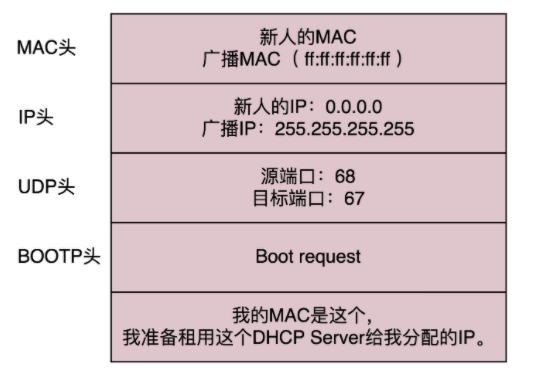
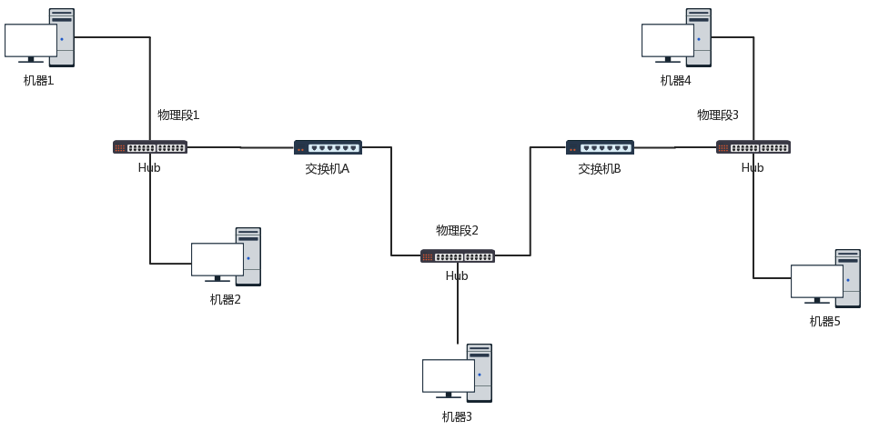

# 网络协议


## 1. 通信协议

### 网络协议构成

**应用层**： 在浏览器里面输入 https://www.kaola.com ，这是一个 URL。浏览器只知道名字是“www.kaola.com”。可以使用DNS或者HTTPDNS。无论用哪一种方法查找，最终都会得到这个地址：**106.114.138.24。这个是 IP 地址，是互联网世界的“门牌号”。** DNS、HTTP、HTTPS 所在的层我们称为应用层。


**传输层：**经过应用层封装后，浏览器会将应用层的包交给下一层去完成，通过 socket 编程来实现。下一层是传输层。传输层有两种协议，一种是无连接的协议 UDP，一种是面向连接的协议 TCP。TCP 协议里面会有两个端口，一个是浏览器监听的端口，一个是电商的服务器监听的端口。操作系统往往通过端口来判断，它得到的包应该给哪个进程。


**网络层：**传输层封装完毕后，浏览器会将包交给操作系统的网络层。网络层的协议是 IP 协议。在 IP 协议里面会有源 IP 地址，即浏览器所在机器的 IP 地址和目标 IP 地址，也即电商网站所在服务器的 IP 地址。


**链路层：**操作系统知道要离开本地去远方，去外地就要去网关。操作系统大吼一声，谁是 192.168.1.1 啊。网关会回答，**这个本地地址就是 MAC 地址，而大吼的那一声是 ARP 协议。**网关收到包之后，会根据自己的知识，判断下一步应该怎么走。**网关往往是一个路由器，到某个 IP 地址应该怎么走，这个叫作路由表。**


网关之间相互沟通，这种沟通的协议称为路由协议，**常用的有 OSPF 和 BGP**。最后一个网关知道这个网络包要去的地方就问谁是目标 IP 啊？**目标服务器就会回复一个 MAC 地址。网络包过关后，通过这个 MAC 地址就能找到目标服务器**。

目标服务器发现 MAC 地址对上了，取下 MAC 头来，发送给操作系统的网络层。发现 IP 也对上了，就取下 IP 头。IP 头里会写上一层封装的是 TCP 协议，然后将其交给传输层，即 TCP 层。


在这一层里，对于收到的每个包，**都会有一个回复的包说明收到了**。而仅仅是 TCP 层的一个说明，即收到之后的回复。当然这个回复，会沿着刚才来的方向走回去，报个平安


### 网络分层


#### 网络包接收

调用 process_layer2(buffer)，摘掉二层的头，看一看，应该根据头里面的内容做什么操作。假设你发现这个包的 MAC 地址和你的相符，那说明就是发给你的，于是需要调用 process_layer3(buffer)。

调用 process_layer3(buffer)，摘掉三层的头，看看到底是发送给自己的，还是希望自己转发出去的。如果 IP 地址不是自己的，那就应该转发出去；如果 IP 地址是自己的，那就是发给自己的。根据 IP 头里面的标示，拿掉三层的头，进行下一层的处理，到底是调用process_tcp(buffer) 呢，还是调用 process_udp(buffer) 呢

调用 process_tcp(buffer)，就需要查看四层的头，看这是一个发起，还是一个应答，又或者是一个正常的数据包，然后分别由不同的逻辑进行处理。如果是发起或者应答，接下来可能要发送一个回复包；如果是一个正常的数据包，就需要交给应用层处理


#### 网络包发送

调用 send_tcp(buffer)。不用说，Buffer 里面就是 HTTP 请求的内容。这个函数里面加一个 TCP 的头，记录下源端口号。浏览器会给你目的端口号，一般为 80 端口。

调用 send_layer3(buffer)。在这个函数里面加一个 IP 的头，记录下源 IP 的地址和目标 IP 的地址。

然后调用 send_layer2(buffer)。这个函数里面要加一下 MAC 的头，记录下源 MAC 地址，得到的就是本机器的 MAC 地址和目标的 MAC 地址。


### IP地址和MAC地址

运行一下 ip addr

```shell
root@test:~# ip addr
1: lo: <LOOPBACK,UP,LOWER_UP> mtu 65536 qdisc noqueue state UNKNOWN group default 
    link/loopback 00:00:00:00:00:00 brd 00:00:00:00:00:00
    inet 127.0.0.1/8 scope host lo
       valid_lft forever preferred_lft forever
    inet6 ::1/128 scope host 
       valid_lft forever preferred_lft forever
2: eth0: <BROADCAST,MULTICAST,UP,LOWER_UP> mtu 1500 qdisc pfifo_fast state UP group default qlen 1000
    link/ether fa:16:3e:c7:79:75 brd ff:ff:ff:ff:ff:ff
    inet 10.100.122.2/24 brd 10.100.122.255 scope global eth0
       valid_lft forever preferred_lft forever
    inet6 fe80::f816:3eff:fec7:7975/64 scope link 
       valid_lft forever preferred_lft foreverxxxxxxxxxx 08:00:27:07:e9:ae brd ff:ff:ff:ff:ffroot@test:~# ip addr1: lo: <LOOPBACK,UP,LOWER_UP> mtu 65536 qdisc noqueue state UNKNOWN group default     link/loopback 00:00:00:00:00:00 brd 00:00:00:00:00:00    inet 127.0.0.1/8 scope host lo       valid_lft forever preferred_lft forever    inet6 ::1/128 scope host        valid_lft forever preferred_lft forever2: eth0: <BROADCAST,MULTICAST,UP,LOWER_UP> mtu 1500 qdisc pfifo_fast state UP group default qlen 1000    link/ether fa:16:3e:c7:79:75 brd ff:ff:ff:ff:ff:ff    inet 10.100.122.2/24 brd 10.100.122.255 scope global eth0       valid_lft forever preferred_lft forever    inet6 fe80::f816:3eff:fec7:7975/64 scope link        valid_lft forever preferred_lft forever
```

本来 32 位的 IP 地址就不够，还被分成了 5 类。

C 类地址能包含的最大主机数量实在太少了，只有 254 个。当时设计的时候恐怕没想到，现在估计一个网吧都不够用吧。而 B 类地址能包含的最大主机数量又太多了。6 万多台机器放在一个网络下面，一般的企业基本达不到这个规模。


#### 无类型域间选路（CIDR）

于是有了一个折中的方式叫作无类型域间选路，简称 CIDR。这种方式打破了原来设计的几类地址的做法，将 32 位的 IP 地址一分为二，前面是网络号，后面是主机号。10.100.122.2/24，这个 IP 地址中有一个斜杠，斜杠后面有个数字 24。这种地址表示形式，就是 CIDR。**后面 24 的意思是，32 位中，前 24 位是网络号，后 8 位是主机号。**

一个是广播地址，10.100.122.255。如果发送这个地址，所有 10.100.122 网络里面的机器都可以收到。另一个是子网掩码，255.255.255.0。**将子网掩码和 IP 地址按位计算 AND，就可得到网络号。**

16.158.165.91/22 这个 CIDR。16.158 的部分不会动，它占了前 16 位。中间的 165，**变为二进制为‭10100101**‬。除了前面的 16 位，还剩 6 位。所以，这 8 位中前 6 位是网络号，16.158.<101001>，而 <01>.91 是机器号。

**地址范围是16.158.<101001><00>.1 至 16.158.<101001><11>.255。16.158.<101001><11>.255 是广播地址，子网掩码是 255.255.<111111><00>.0**


#### MAC 地址

一个网络包要从一个地方传到另一个地方，除了要有确定的地址，还需要有定位功能。 而有门牌号码属性的 IP 地址，才是有远程定位功能的。

**MAC 地址更像是身份证，是一个唯一的标识。**它的唯一性设计是为了组网的时候，不同的网卡放在一个网络里面的时候，可以不用担心冲突。从硬件角度，保证不同的网卡有不同的标识。

MAC 地址的通信范围比较小，局限在一个子网里面。一旦跨子网，即从 192.168.0.2/24 到 192.168.1.2/24，MAC 地址就不行了，需要 IP 地址起作用了。


#### 网络设备的状态标识

**<BROADCAST,MULTICAST,UP,LOWER_UP> 叫做 net_device flags**，网络设备的状态标识。

+ UP 表示网卡处于启动的状态；
+ BROADCAST 表示这个网卡有广播地址，可以发送广播包；
+ MULTICAST 表示网卡可以发送多播包；
+ LOWER_UP 表示 L1 是启动的，也即网线插着呢。
+ MTU1500 是指最大传输单元 MTU 为 1500，这是以太网的默认值。


**qdisc 全称是 queueing discipline，中文叫排队规则**

+ 最简单的是 pfifo，它不对进入的数据包做任何的处理，数据包采用先入先出的方式通过队列。
+ pfifo_fast 稍微复杂一些，它的队列包括三个波段（band）。在每个波段里面，使用先进先出规则。三个波段（band）的优先级也不相同。band 0 的优先级最高，band 2 的最低。如果 band 0 里面有数据包，系统就不会处理 band 1 里面的数据包。


### DHCP

如果是数据中心里面的服务器，IP 一旦配置好，基本不会变，这就相当于买房自己装修。DHCP 的方式就相当于租房。你不用装修，都是帮你配置好的。

#### 工作方式

新来的机器使用 IP 地址 0.0.0.0 发送了一个广播包，目的 IP 地址为 255.255.255.255。广播包封装了 UDP，UDP 封装了 BOOTP。其实 DHCP 是 BOOTP 的增强版，我们称为 **DHCP Discover。**


DHCP Server 的话根据MAC 地址唯一确定是新的设备，需要租给它一个 IP 地址，这个过程我们称为 **DHCP Offer**。DHCP Server 回复说，我分配了一个可用的 IP 给你


新的设备会选择其中一个 DHCP Offer，并且会向网络发送一个 DHCP Request 广播数据包，包中包含客户端的 MAC 地址、接受的租约中的 IP 地址、提供此租约的 DHCP 服务器地址等，并告诉所有 DHCP Server 它将接受哪一台服务器提供的 IP 地址。



当 DHCP Server 接收到客户机的 DHCP request 之后，会广播返回给客户机一个 DHCP ACK 消息包，表明已经接受客户机的选择，并将这一 IP 地址的合法租用信息和其他的配置信息都放入该广播包，发给客户机


#### IP 地址的收回和续租

客户机会在租期过去 50% 的时候，直接向为其提供 IP 地址的 DHCP Server 发送 DHCP request 消息包。客户机接收到该服务器回应的 DHCP ACK 消息包，会根据包中所提供的新的租期以及其他已经更新的 TCP/IP 参数，更新自己的配置


#### 预启动执行环境（Pre-boot Execution Environment）

PXE 协议分为客户端和服务器端，由于还没有操作系统，**只能先把客户端放在 BIOS 里面。**当计算机启动时，BIOS 把 PXE 客户端调入内存里面，就可以连接到服务端做一些操作了。

DHCP Server 是需要配置的 next-server，指向 PXE 服务器的地址，另外要配置初始启动文件 filename。

```JSON
ddns-update-style interim;
ignore client-updates;
allow booting;
allow bootp;
subnet 192.168.1.0 netmask 255.255.255.0
{
option routers 192.168.1.1;
option subnet-mask 255.255.255.0;
option time-offset -18000;
default-lease-time 21600;
max-lease-time 43200;
range dynamic-bootp 192.168.1.240 192.168.1.250;
filename "pxelinux.0";
next-server 192.168.1.180;
}
```


启动 PXE 客户端。第一步是通过 DHCP 协议告诉 DHCP Server。DHCP Server 便租给它一个 IP 地址，同时也给它 PXE 服务器的地址、启动文件 **pxelinux.0。**


PXE 客户端知道要去 PXE 服务器下载这个文件后，就可以初始化机器。于是便开始下载，下载的时候使用的是 TFTP 协议。所以 PXE 服务器上，往往还需要有一个 TFTP 服务器。


PXE 客户端向 TFTP 服务器请求下载这个文件，TFTP 服务器就将这个文件传给它。然后，PXE 客户端收到这个文件后，就开始执行这个文件。**这个文件会指示 PXE 客户端，向 TFTP 服务器请求计算机的配置信息 pxelinux.cfg。**TFTP 服务器会给 PXE 客户端一个配置文件，里面会说内核在哪里、initramfs 在哪里。PXE 客户端会请求这些文件。


## 2. 网络基础知识

### 物理层

电脑连电脑， 一头插在一台电脑的网卡上，另一头插在另一台电脑的网卡上。两台电脑已经构成了一个最小的局域网，也即 LAN。

Hub 的东西，也就是集线器。这种设备有多个口，可以将多台电脑连接起来。它完全在物理层工作。它会将自己收到的每一个字节，都复制到其他端口上去。


### 数据链路层

数据链路层，也即 MAC 层要解决的问题。**MAC 的全称是 Medium Access Control，即媒体访问控制**


#### 信号发送规则

其实就是控制在往媒体上发数据的时候，谁先发、谁后发的问题。防止发生混乱。

+ **信道划分**：分多个车道。每个车一个车道，你走你的，我走我的。
+ **轮流协议**：今天单号出行，明天双号出行，轮着来。
+ **随机接入协议**：有事儿先出门，发现特堵，就回去。错过高峰再出。**著名的以太网，用的就是这个方式。**


#### 数据包格式

解决谁发送，谁接收


对于以太网，第二层的最开始，就是目标的 MAC 地址和源的 MAC 地址。类型，大部分的类型是 IP 数据包，然后 IP 里面包含 TCP、UDP，以及 HTTP 等，这都是里层封装的事情。


#### 数据验证

CRC，也就是循环冗余检测。通过 XOR 异或的算法，来计算整个包是否在发送的过程中出现了错误


#### ARP协议

已知IP地址求MAC地址


#### 交换机 Exchanger

一台 MAC1 电脑将一个包发送给另一台 MAC2 电脑，当这个包到达交换机的时候，一开始交换机也不知道 MAC2 的电脑在哪个口，所以它只能将包转发给除了来的那个口之外的其他所有的口。**但是交换机会记住MAC1 是来自一个明确的口。以后有包的目的地址是 MAC1 的，直接发送到这个口就可以了, 这就是转发表。**


#### 拓扑结构

交换机肯定不够用，需要多台交换机，交换机之间连接起来，就形成一个稍微复杂的拓扑结构。我们先来看两台交换机的情形。两台交换机连接着三个局域网，每个局域网上都有多台机器。



##### 环路问题


机器 1 的广播包到达交换机 A 和交换机 B 的时候，本来两个交换机都学会了机器 1 是在局域网一的，**但是当交换机 A 将ARP ACK包广播到局域网二之后**，交换机 B 右边的网口收到了来自交换机 A 的广播包。**根据学习机制，这彻底损坏了交换机 B 的三观，刚才机器 1 还在左边的网口呢，怎么又出现在右边的网口呢， 循环往复。**


##### Spanning Tree Protocol


在 STP 协议里面有很多概念

+ **Root Bridge**，也就是根交换机。
+ **Designated Bridges**，有的翻译为指定交换机。可以想像成一个“小弟”。
+ **Bridge Protocol Data Units （BPDU）** ，网桥协议数据单元。可以比喻为“相互比较实力”的协议。**BPDU 只有掌门能发，已经隶属于某个掌门的交换机只能传达掌门的指示**。
+ **Priority Vector**，优先级向量，就是一组 ID 数目，[Root Bridge ID, Root Path Cost, Bridge ID, and Port ID]


Root Bridge 进行合并

+ 不同Root Bridge： **比较Root Bridge ID, 越小优先级越高**
+ 在一个Root Bridge下
  + Root Bridge 和 Designated Bridges： Designated Bridges 更新 Root Path Cost
  + Designated Bridges 和 Designated Bridges： Designated Bridges 比较 Root Path Cost
+ 不同Root Bridge
  + Root Bridge 和 Designated Bridges： 比较 Root Bridge ID
  + Designated Bridges 和 Designated Bridges： 比较格子Root Bridge ID


#### 虚拟局域网

解决广播的安全信息隔离， 原来的二层的头上加一个 TAG，里面有一个 VLAN ID，一共 12 位。


换机是支持 VLAN 的，当这个交换机把二层的头取下来的时候，就能够识别这个 VLAN ID。这样只有相同 VLAN 的包，才会互相转发，不同 VLAN 的包，是看不到的。这样广播问题和安全问题就都能够解决了。


### 网络层

#### ICMP协议

ICMP 全称 Internet Control Message Protocol，就是互联网控制报文协议。ICMP 报文是封装在 IP 包里面的


##### 查询报文类型

**ICMP ECHO REQUEST**： 一种主动请求，并且获得主动应答的 ICMP 协议

**ICMP ECHO REPLY**：多了两个字段，一个是标识符 ICMP查询类型，另一个是序号，你派出去的侦查兵，都要编个号


##### 差错报文类型

终点不可达

+ 网络不可达
+ 主机不可达
+ 协议不可达
+ 端口不可达
+ 需要分片

源站抑制：让源站放慢发送速度

时间超时：超过网络包的生存时间还是没到

路由重定向：让下次发给另一个路由器


##### ping


ICMP 数据包内包含多个字段。

+ **类型**: **请求数据包是 8， 回复数据包是0**
+ 顺序号，主要用于区分连续 ping 的时候发出的多个数据包。每发出一个请求数据包，顺序号会自动加 1


当遇到网络不通的问题的时候，通过 tcpdump -i eth0 icmp，查看包有没有到达某个点。

```SHELL
➜  ~ tcpdump -i en0 icmp
tcpdump: verbose output suppressed, use -v or -vv for full protocol decode
listening on en0, link-type EN10MB (Ethernet), capture size 262144 bytes
23:34:18.902716 IP 192.168.1.102 > 172.217.194.99: ICMP echo request, id 37669, seq 0, length 64
23:34:18.909557 IP 172.217.194.99 > 192.168.1.102: ICMP echo reply, id 37669, seq 0, length 64
23:34:19.903276 IP 192.168.1.102 > 172.217.194.99: ICMP echo request, id 37669, seq 1, length 64
23:34:19.912920 IP 172.217.194.99 > 192.168.1.102: ICMP echo reply, id 37669, seq 1, length 64
23:34:20.903844 IP 192.168.1.102 > 172.217.194.99: ICMP echo request, id 37669, seq 2, length 64
23:34:20.910938 IP 172.217.194.99 > 192.168.1.102: ICMP echo reply, id 37669, seq 2, length 64
23:34:21.905690 IP 192.168.1.102 > 172.217.194.99: ICMP echo request, id 37669, seq 3, length 64
23:34:21.911117 IP 172.217.194.99 > 192.168.1.102: ICMP echo reply, id 37669, seq 3, length 64
23:34:22.905628 IP 192.168.1.102 > 172.217.194.99: ICMP echo request, id 37669, seq 4, length 64
23:34:22.913086 IP 172.217.194.99 > 192.168.1.102: ICMP echo reply, id 37669, seq 4, length 64
23:34:23.910042 IP 192.168.1.102 > 172.217.194.99: ICMP echo request, id 37669, seq 5, length 64
23:34:23.920326 IP 172.217.194.99 > 192.168.1.102: ICMP echo reply, id 37669, seq 5, length 64
23:34:24.914242 IP 192.168.1.102 > 172.217.194.99: ICMP echo request, id 37669, seq 6, length 64
```


##### Traceroute：差错报文类型的使用

Traceroute 的第一个作用就是故意设置特殊的 Time To Live，来追踪去往目的地时沿途经过的路由器

如果中间的路由器不止一个，当然碰到第一个就“牺牲”。于是，**返回一个 ICMP 包，也就是网络差错包，类型是时间超时**。接下来，将 TTL 设置为 2。第一关过了，第二关就“牺牲”了，那我就知道第二关有多远。如此反复，直到到达目的主机

Traceroute 程序会发送一份 UDP 数据报给目的主机，但它会选择一个不可能的值作为 UDP 端口号（大于 30000）。当该数据报到达时，将使目的主机的 UDP 模块产生一份“端口不可达”错误 ICMP 报文。

```shell
➜  ~ traceroute www.google.com
traceroute: Warning: www.google.com has multiple addresses; using 172.217.194.99
traceroute to www.google.com (172.217.194.99), 64 hops max, 52 byte packets
 1  singtel-acplus (192.168.1.254)  6.140 ms  5.183 ms  4.305 ms
 2  bb219-74-115-254.singnet.com.sg (219.74.115.254)  6.770 ms  4.194 ms  3.532 ms
 3  202.166.123.134 (202.166.123.134)  5.546 ms  4.899 ms  5.700 ms
 4  202.166.123.133 (202.166.123.133)  4.342 ms  5.760 ms  5.130 ms
 5  ae8-0.tp-cr03.singnet.com.sg (202.166.122.50)  7.463 ms  5.876 ms  5.277 ms
 6  ae4-0.tp-er03.singnet.com.sg (202.166.123.70)  6.476 ms  5.374 ms  6.097 ms
 7  203.208.191.197 (203.208.191.197)  6.466 ms
    203.208.191.113 (203.208.191.113)  5.531 ms  6.991 ms
 8  72.14.210.137 (72.14.210.137)  8.493 ms  7.947 ms  4.143 ms
 9  74.125.242.34 (74.125.242.34)  5.186 ms
    108.170.240.172 (108.170.240.172)  6.194 ms
    74.125.242.35 (74.125.242.35)  5.176 ms
10  216.239.35.174 (216.239.35.174)  5.770 ms
    216.239.57.50 (216.239.57.50)  5.798 ms
    72.14.235.152 (72.14.235.152)  6.958 ms
11  74.125.253.62 (74.125.253.62)  7.955 ms
    209.85.242.109 (209.85.242.109)  7.478 ms
    209.85.253.230 (209.85.253.230)  6.570 ms
12  209.85.246.17 (209.85.246.17)  7.729 ms
    209.85.246.15 (209.85.246.15)  9.310 ms
    209.85.246.19 (209.85.246.19)  7.663 ms
```


#### 网关 Gateway


**如果是同一个网段**，直接将源地址和目标地址放入 IP 头中，然后通过 ARP 获得 MAC 地址，将源 MAC 和目的 MAC 放入 MAC 头中，发出去就可以了。

**如果不是同一网段**，这就需要发往默认网关 Gateway。Gateway 的地址一定是和源 IP 地址是一个网段的。例如 192.168.1.0/24 这个网段，Gateway 往往会是 192.168.1.1/24 或者 192.168.1.2/24。

网关往往是一个路由器，是一个三层转发的设备。路由器是一台设备，它有五个网口或者网卡，相当于有五只手，**分别连着五个局域网。每只手的 IP 地址都和局域网的 IP 地址相同的网段**，每只手都是它握住的那个局域网的网关。


##### IP不变


服务器 A 要访问服务器 B

> 源 MAC：服务器 A 的 MAC
> 目标 MAC：192.168.1.1 这个网口的 MAC
> 源 IP：192.168.1.101
> 目标 IP：192.168.4.101

在路由器 A 中配置了静态路由之后，要想访问 192.168.4.0/24，要从 192.168.56.1 这个口出去，下一跳为 192.168.56.2。

> 源 MAC：192.168.56.1 的 MAC 地址
> 目标 MAC：192.168.56.2 的 MAC 地址
> 源 IP：192.168.1.101
> 目标 IP：192.168.4.101

路由器 B 思考的时候，匹配上了这条路由，要从 192.168.4.1 这个口发出去，发给 192.168.4.101

> 源 MAC：192.168.4.1 的 MAC 地址
> 目标 MAC：192.168.4.101 的 MAC 地址
> 源 IP：192.168.1.101
> 目标 IP：192.168.4.101

每到一个新的局域网，**MAC 都是要变的，但是 IP 地址都不变**。在 IP 头里面，不会保存任何网关的 IP 地址。所谓的下一跳是，某个 IP 要将这个 IP 地址转换为 MAC 放入 MAC 头。


##### IP变化

这个过程用英文说就是 **Network Address Translation**，简称 NAT。


最左面大唐的地址是 192.168.1.101，最右面印度的地址也是 192.168.1.101。首先，目标服务器 B 在国际上要有一个国际的身份，我们给它一个 192.168.56.2。在网关 B 上，我们记下来，国际身份 192.168.56.2 对应国内身份 192.168.1.101。凡是要访问 192.168.56.2，都转成 192.168.1.101

源服务器 A 要访问目标服务器 B，要指定的目标地址为 192.168.56.2

> 源 MAC：服务器 A 的 MAC
> 目标 MAC：192.168.1.1 这个网口的 MAC
> 源 IP：192.168.1.101
> 目标 IP：192.168.56.2

服务器 A 也需要有个国际身份，因而在国际上，**源 IP 地址也不能用 192.168.1.101，需要改成 192.168.56.1**

> 源 MAC：192.168.56.1 的 MAC 地址
> 目标 MAC：192.168.56.2 的 MAC 地址
> 源 IP：192.168.56.1
> 目标 IP：192.168.56.2

**路由器 B 是一个 NAT 网关**，它上面配置了，要访问国际身份 192.168.56.2 对应国内身份 192.168.1.101，于是改为访问 192.168.1.101

> 源 MAC：192.168.1.1 的 MAC 地址
> 目标 MAC：192.168.1.101 的 MAC 地址
> 源 IP：192.168.56.1
> 目标 IP：192.168.1.101


#### 路由协议

##### 静态路由

一个本地的转发信息库，来决定如何正确地转发流量。这个转发信息库通常被称为路由表。一张路由表中会有多条路由规则。每一条规则至少包含这三项信息。

+ 目的网络
+ 出口设备
+ 下一跳网关

```SHELL
[root@k8s-master ~]# route
Kernel IP routing table
Destination     Gateway         Genmask         Flags Metric Ref    Use Iface
default         gateway         0.0.0.0         UG    100    0        0 enp0s3
10.0.2.0        0.0.0.0         255.255.255.0   U     100    0        0 enp0s3
172.17.0.0      0.0.0.0         255.255.0.0     U     0      0        0 docker0
192.168.66.0    0.0.0.0         255.255.255.0   U     101    0        0 enp0s8
```

在真实的复杂的网络环境中，还可以根据多个参数来配置路由，这就称为**策略路由**

```properties
# 表示从 192.168.1.10/24 这个网段来的，使用 table 10 中的路由表，而从 192.168.2.0/24 网段来的，使用 table20 的路由表。
ip rule add from 192.168.1.0/24 table 10 
ip rule add from 192.168.2.0/24 table 20

#下一跳有两个地方，分别是 100.100.100.1 和 200.200.200.1，权重分别为 1 比 2
ip route add default scope global nexthop via 100.100.100.1 weight 1 nexthop via 200.200.200.1 weight 2
```


```SHELL
$ ip route list table main 
60.190.27.189/30 dev eth3  proto kernel  scope link  src 60.190.27.190
183.134.188.1 dev eth2  proto kernel  scope link  src 183.134.189.34
192.168.1.0/24 dev eth1  proto kernel  scope link  src 192.168.1.1
127.0.0.0/8 dev lo  scope link
default via 183.134.188.1 dev eth2
```

当路由这样配置的时候，就告诉这个路由器如下的规则：

+ 如果去运营商二，就走 eth3；
+ 如果去运营商一，就走 eth2；
+ 如果访问内网，就走 eth1；
+ 如果所有的规则都匹配不上，默认走运营商一，也即走快的网络。


设置租户A默认走运营商二

```shell
# echo 200 chao >> /etc/iproute2/rt_tables
# ip rule add from 192.168.1.101 table chao
# ip rule ls
0:  from all lookup local 
32765:  from 10.0.0.10 lookup chao
32766:  from all lookup main 
32767:  from all lookup default


# ip route add default via 60.190.27.189 dev eth3 table chao
# ip route flush cache
```


##### 动态路由

###### 距离矢量路由

这种算法的基本思路是，每个路由器都保存一个路由表，包含多行，每行对应网络中的一个路由器，每一行包含两部分信息，一个是要到目标路由器，从那条线出去，另一个是到目标路由器的距离。存在问题

+ **问题是好消息传得快，坏消息传得慢。**一旦一个路由器挂了，直到试过了所有的路径，才发现这个路由器是真的挂了。
+ 问题是每次发送的时候，要发送整个全局路由


###### 链路状态路由

**基于链路状态路由算法的 OSPF (Open Shortest Path First，开放式最短路径优先)**。由于主要用在数据中心内部，用于路由决策，因而称为内部网关协议（**Interior Gateway Protocol，简称 IGP）**。


**基于距离矢量路由算法的 BGP**， 外网路由协议（Border Gateway Protocol，简称 BGP）。


+ 分为两类
  + 边界路由器之间使用 eBGP 广播路由
  + AS内部使用iBGP
+ 每个路由系统之间形成一个AS， Autonomous System
  + Stub AS：对外只有一个连接。这类 AS 不会传输其他 AS 的包。
  + Multihomed AS：可能有多个连接连到其他的 AS，但是大多拒绝帮其他的 AS 传输包。
  + Transit AS：有多个连接连到其他的 AS，并且可以帮助其他的 AS 传输包。例如主干网。
+ BGP 协议使用的算法是路径矢量路由协议（path-vector protocol）。它是距离矢量路由协议的升级版。
  + 因为矢量，一旦A不可达， B知道C到达A要经过自己，则C不可到达A
  + 在路径中将一个自治系统看成一个整体，不区分自治系统内部的路由器


### 传输层

#### TCP 和 UDP 区别

**TCP 提供可靠交付。**通过 TCP 连接传输的数据，无差错、不丢失、不重复、并且按序到达。 **UDP 继承了 IP 包的特性，不保证不丢失，不保证按顺序到达。**

**TCP 是面向字节流的**。发送的时候发的是一个流，没头没尾。**UDP基于数据报的**，一个一个地发，一个一个地收。

**TCP 是可以有拥塞控制的**。它意识到包丢弃了或者网络的环境不好了，就会根据情况调整自己的行为。**UDP应用让我发，我就发。**

TCP 其实是一个有状态服务。UDP 则是无状态服务。


#### UDP


##### 三大特点

+ 沟通简单，没有大量的数据结构、处理逻辑、包头字段。
+ 轻信他人。有端口号，但是监听在这个地方，谁都可以传给他数据，他也可以传给任何人数据，甚至可以同时传给多个人数据。
+ 不懂权变。不会根据网络的情况进行发包的拥塞控制，无论网络丢包丢成啥样了，它该怎么发还怎么发。


##### 使用场景基于

+ 需要资源少，在网络情况比较好的内网，或者对于丢包不敏感的应用。
+ 不需要一对一沟通，而是可以广播的应用。
+ 需要处理速度快，时延低，可以容忍少数丢包，但是要求即便网络拥塞。


##### 应用

###### 页或者 APP 的访问

HTTP 协议是基于 TCP 的，建立连接都需要多次交互，对于时延比较大的目前主流的移动互联网来讲，建立一次连接需要的时间会比较长，然而既然是移动中，TCP 可能还会断了重连，也是很耗时的。 **QUIC（全称 Quick UDP Internet Connections，快速 UDP 互联网连接）是 Google 提出的一种基于 UDP 改进的通信协议**，其目的是降低网络通信的延迟，提供更好的用户互动体验。


###### 流媒体的协议

现在直播比较火，**直播协议多使用 RTMP也是基于 TCP 的**。TCP 的严格顺序传输要保证前一个收到了，下一个才能确认，如果前一个收不到，下一个就算包已经收到了，在缓存里面，也需要等着。对于直播来讲，这显然是不合适的。

因而，很多直播应用，都基于 UDP 实现了自己的视频传输协议。


###### 实时游戏

游戏对实时要求较为严格的情况下，采用自定义的可靠 UDP 协议，自定义重传策略，能够把丢包产生的延迟降到最低，尽量减少网络问题对游戏性造成的影响。


###### IoT 物联网

联网对实时性要求也很高。Google 旗下的 Nest 建立 Thread Group，推出了物联网通信协议 Thread，就是基于 UDP 协议的。


###### 移动通信领域

在 4G 网络里，移动流量上网的数据面对的协议 GTP-U 是基于 UDP 的。


#### TCP

##### 包头格式


+ 源端口号和目标端口号是不可少的。如果没有这两个端口号。
+ 序号：是为了解决乱序的问题。
+ 确认序号：发出去的包应该有确认，要不然我怎么知道对方有没有收到呢。
+ 状态位：SYN 是发起一个连接，ACK 是回复，RST 是重新连接，FIN 是结束连接等


##### 三次握手

> A：您好，我是 A。
> B：您好 A，我是 B。
> A：您好 B。


+ 一开始，客户端和服务端都处于 CLOSED 状态。
+ 先是服务端主动监听某个端口，处于 LISTEN 状态。
+ 然后客户端主动发起连接 SYN，之后处于 SYN-SENT 状态。
+ 服务端收到发起的连接，返回 SYN，并且 ACK 客户端的 SYN，之后处于 SYN-RCVD 状态。
+ 客户端收到服务端发送的 SYN 和 ACK 之后，发送 ACK 的 ACK，之后处于 ESTABLISHED 状态，
+ 服务端收到 ACK 的 ACK 之后，处于 ESTABLISHED 状态，因为它也一发一收了。


###### 两次握手

A 建立连接的时候，请求包重复发了几次，有的请求包绕了一大圈又回来了，B 会认为这也是一个正常的的请求的话，因此建立了连接，可以想象，这个连接不会进行下去，也没有个终结的时候，纯属单相思了。因而两次握手肯定不行。

###### 序号生产

每个连接都要有不同的序号。这个序号的起始序号是随着时间变化的，可以看成一个 32 位的计数器，每 4ms 加一，如果计算一下，如果到重复，需要 4 个多小时，那个绕路的包早就死翘翘了


##### 四次挥手

###### 时序图

> A：B 啊，我不想玩了。
> B：哦，你不想玩了啊，我知道了。
> B：A 啊，好吧，我也不玩了，拜拜。
> A：好的，拜拜。


+ 当 A 说“不玩了”，就进入 FIN_WAIT_1 的状态，
+ B 收到“A 不玩”的消息后，发送知道了，就进入 CLOSE_WAIT 的状态。
+ A 收到“B 说知道了”，就进入 FIN_WAIT_2 的状态
+ 如果 B 发送了“B 也不玩了”，然后进入LAST_ACK装填
+ 当B的请求到达 A 时，A 发送“知道 B 也不玩了”的 ACK 后，进入TIME_WAIT状态
+ 最后A和B进入CLOSED状态


###### Maximum Segment Lifetime

等待的时间设为 2MSL，MSL 是 Maximum Segment Lifetime，报文最大生存时间，它是任何报文在网络上存在的最长时间，超过这个时间报文将被丢弃。

B 超过了 2MSL 的时间，依然没有收到它发的 FIN 的 ACK。B 当然还会重发 FIN，这个时候 A 再收到这个包之后，A 就表示，我已经在这里等了这么长时间了，之后的我就都不认了，于是就直接发送 RST，B 就知道 A 早就跑了。


##### 状态机


##### 累计应答（cumulative acknowledgment）

###### 发送端

缓存里是按照包的 ID 一个个排列，根据处理的情况分成四个部分。

+ 发送了并且已经确认的
+ 发送了并且尚未确认的
+ 没有发送，但是已经等待发送的
+ 没有发送，并且暂时还不会发送的


Advertised window等于上面的第二部分加上第三部分


###### 接收端

+ 接受并且确认过的
+ 还没接收，但是马上就能接收的。
+ 还没接收，也没法接收的


MaxRcvBuffer：最大缓存的量

LastByteRead 之后是已经接收了，但是还没被应用层读取的

AdvertisedWindow=MaxRcvBuffer-((NextByteExpected-1)-LastByteRead)


##### 顺序问题与丢包问题

###### 超时重试

也即对每一个发送了，但是没有 ACK 的包，都有设一个定时器，超过了一定的时间，就重新尝试。这个时间不宜过短，时间必须大于往返时间 RTT，也不宜过长。需要通过**自适应重传算法（Adaptive Retransmission Algorithm）**进行采样

TCP 的策略是超时间隔加倍。每当遇到一次超时重传的时候，都会将下一次超时时间间隔设为先前值的两倍。两次超时，就说明网络环境差，不宜频繁反复发送


###### Selective Acknowledgment

这种方式需要在 TCP 头里加一个 SACK 的东西，可以将缓存的地图发送给发送方。例如可以发送 ACK6、SACK8、SACK9，有了地图，发送方一下子就能看出来是 7 丢了


##### 流量控制

**接收端的应用一直不读取缓存中的数据**，当数据包 6 确认后，窗口大小就不能再是 9 了，**就要缩小一个变为 8**。


**这个新的窗口 8 通过 6 的确认消息到达发送端的时候**，你会发现窗口没有平行右移，而是仅仅左面的边右移了，窗口的大小从 9 改成了 8


如果接收端还是一直不处理数据，则随着确认的包越来越多，窗口越来越小，直到为 0


##### 拥塞控制

拥塞控制的问题，也是通过窗口的大小来控制的，前面的滑动窗口 rwnd 是怕发送方把接收方缓存塞满，**而拥塞窗口 cwnd，是怕把网络塞满**。于是 TCP 的拥塞控制主要来避免两种现象，包丢失和超时重传。一旦出现了这些现象就说明，发送速度太快了，要慢一点。


一条 TCP 连接开始，cwnd 设置为一个报文段，一次只能发送一个，确认后变为4，然后4，然后8， 可以看出这是指数性的增长。

有一个值 ssthresh 为 65535 个字节，当超过这个值的时候，再慢下来。每收到一个确认后，cwnd 增加 1/cwnd。变成了线性增长。


拥塞的一种表现形式是丢包，需要超时重传

**传统算法**：这个时候，将 sshresh 设为 cwnd/2，将 cwnd 设为 1，重新开始慢启动

**快速重传算法**：当接收端发现丢了一个中间包的时候，**发送三次前一个包的 ACK**，于是发送端就会快速地重传，不必等待超时再重传。**cwnd 减半为 cwnd/2，然后 sshthresh = cwnd，当三个包返回的时候，cwnd = sshthresh + 3**

###### 遗留问题

+ 丢包并不代表着通道满了，也可能是管子本来就漏水
+ 其实 TCP 只要填满管道就可以了，不应该接着填，直到连缓存也填满。

###### BBR 拥塞算法

TCP BBR 拥塞算法。它企图找到一个平衡点，就是通过不断地加快发送速度，将管道填满，但是不要填满中间设备的缓存


#### Socket

##### TCP 协议的 Socket 程序函数调用过程。

TCP 的服务端要先监听一个端口，一般是先调用 bind 函数，给这个 Socket 赋予一个 IP 地址和端口。当服务端再调用 listen 函数进行监听。

每个 Socket 维护两个队列。

+ 一个是已经建立了连接的队列，这时候连接三次握手已经完毕，处于 established 状态
+ 一个是还没有完全建立连接的队列，这个时候三次握手还没完成，处于 syn_rcvd 的状态。

服务端调用 accept 函数，拿出一个已经完成的连接进行处理。

客户端可以通过 connect 函数发起连接。先在参数中指明要连接的 IP 地址和端口号，然后开始发起三次握手。内核会给客户端分配一个临时的端口。一旦握手成功，服务端的 accept 就会返回另一个 Socket。监听的 Socket 和真正用来传数据的 Socket 是两个，**一个叫作监听 Socket，一个叫作已连接 Socket。**


Socket 是一个文件，那对应就有文件描述符。每一个进程都有一个数据结构 task_struct，**里面指向一个文件描述符数组，来列出这个进程打开的所有文件的文件描述符**。文件描述符是一个整数，是这个数组的下标。这个数组中的内容是一个指针，指向内核中所有打开的文件的列表。Socket 对应的 inode 只保存在内存中的。

**一个是发送队列，一个是接收队列。在这两个队列里面保存的是一个缓存 sk_buff。这个缓存里面能够看到完整的包的结构**


##### UDP 协议的 Socket 程序函数调用过程


##### Socket 模型

**最大连接数限制**，系统会用一个四元组来标识一个 TCP 连接。最大 TCP 连接数 = 客户端 IP 数×客户端端口数。对 IPv4，客户端的 IP 数最多为 2 的 32 次方，客户端的端口数最多为 2 的 16 次方，也就是服务端单机最大 TCP 连接数，**约为 2 的 48 次方**。

```JSON
{本机IP, 本机端口, 对端IP, 对端端口}
```

**文件描述符限制**，要通过 ulimit 配置文件描述符的数目

**内存限制**


###### 多进程方式

在 Linux 下，创建子进程使用 fork 函数。根据 fork 的返回值来区分到底是父进程，还是子进程。如果返回值是 0，则是子进程；如果返回值是其他的整数，就是父进程。

子进程就可以通过这个已连接 Socket 和客户端进行互通了，当通信完毕之后，就可以退出进程


###### 多线程方式

通过 pthread_create 创建一个线程，也是调用 do_fork。很多资源，例如文件描述符列表、进程空间，还是共享的，只不过多了一个引用而已。


###### IO 多路复用，一个线程维护多个 Socket NIO

Socket 是文件描述符，因而某个线程盯的所有的 Socket，都放在一个文件描述符集合 fd_set 中，这就是项目进度墙，然后调用 select 函数来监听文件描述符集合是否有变化。


###### IO 多路复用，从“派人盯着”到“有事通知” AIO

epoll进行事件通知， 通过注册 callback 函数的方式，当某个文件描述符发送变化的时候，就会主动通知。


epoll_create 创建一个 epoll 对象。在红黑树里，要保存这个 epoll 要监听的所有 Socket。当 epoll_ctl 添加一个 Socket 的时候，其实是加入这个红黑树。


### 应用层

#### HTTP协议

##### HTTP请求

HTTP 的报文大概分为三大部分。第一部分是请求行，第二部分是请求的首部，第三部分才是请求的正文实体。


###### 请求行

请求行在请求行中，URL 就是 http://www.163.com ，版本为 HTTP 1.1。

方法

+ GET: 去服务器获取一些资源
+ POST: 主动告诉服务端一些信息
+ PUT: 向指定资源位置上传最新内容
+ DELETE: 删除资源

###### 首部字段

首部是 key value，通过冒号分隔

+ Accept-Charset: 表示客户端可以接受的字符集
+ Content-Type: 是指正文的格式
+ Cache-control: 用来控制缓存的，e.g. Cache-Control: max-age=<seconds>
+ If-Modified-Since: 如果服务器的资源在某个时间之后更新了，那么客户端就应该下载最新的资源


##### HTTP返回


###### 状态码

+ “200”意味着大吉大利
+ “404”，也就是“服务端无法响应这个请求”

###### 首部字段

+ Retry-After 表示，告诉客户端应该在多长时间以后再次尝试一下
+ Content-Type，表示返回的是 HTML，还是 JSON。


#### HTTP 2.0

HTTP 2.0 协议将一个 TCP 的连接中，切分成多个流，每个流都有自己的 ID，是双向的。

HTTP 2.0 还将所有的传输信息分割为更小的消息和帧，并对它们采用二进制格式编码。常见的帧有 **Header 帧**，用于传输 Header 内容，并且会开启一个新的流。再就**是 Data 帧**，用来传输正文实体。


HTTP 2.0 其实是将三个请求变成三个流，将数据分成帧，乱序发送到一个 TCP 连接中。


#### QUIC 协议

##### 连接机制

基于 UDP是以一个 64 位的随机数作为 ID 来标识，所以当 IP 或者端口变化的时候，只要 ID 不变，就不需要重新建立连接。

##### 重传机制

QUIC 也有个序列号，是递增的。任何一个序列号的包只发送一次，下次就要加一了。


##### 无阻塞的多路复用

QUIC 是基于 UDP 的，一个连接上的多个 stream 之间没有依赖。这样，假如 stream2 丢了一个 UDP 包，需要重传，但是 stream3 的包无需等待，就可以发给用户。

##### 流量控制

QUIC 的流量控制也是通过 window_update，来告诉对端它可以接受的字节数。不但在一个连接上控制窗口，还在一个连接中的每个 stream 控制窗口。

QUIC 的 ACK 是基于 offset 的，每个 offset 的包来了，进了缓存，就可以应答，应答后就不会重发，中间的空档会等待到来或者重发即可。


#### HTTPS

##### 加密

###### 对称加密

对称加密算法中，加密和解密使用的密钥是相同的。

###### 非对称加密

非对称加密的私钥放在外卖网站这里，不会在互联网上传输，这样就能保证这个密钥的私密性。但是，对应私钥的公钥，是可以在互联网上随意传播的，只要外卖网站把这个公钥给你，你们就可以愉快地互通了。

###### 数字证书

这个由权威部门颁发的称为证书（Certificate）。证书里面有

+ 公钥
+ 证书的所有者
+ 证书的发布机构
+ 证书的有效期

权威机构会用CA 的私钥给这个证书卡一个章，我们称为签名算法。

```shell
#创建私钥。
openssl genrsa -out cliu8siteprivate.key 1024
#再根据这个私钥，创建对应的公钥。
openssl rsa -in cliu8siteprivate.key -pubout -outcliu8sitepublic.pem

# 签名证书
openssl x509 -req -in cliu8sitecertificate.req -CA cacertificate.pem -CAkey caprivate.key -out cliu8sitecertificate.pem
# 查看证书内容
openssl x509 -in cliu8sitecertificate.pem -noout -text 
```

要想验证证书，需要 CA 的公钥。CA 的公钥也需要更牛的 CA 给它签名，然后形成 CA 的证书。直到全球皆知的几个著名大 CA，称为 **root CA**


##### 工作模式


+ 客户端会发送 Client Hello 消息到服务器，以明文传输 TLS 版本信息、加密套件候选列表、压缩算法候选列表等信息， 还会有一个随机数，在协商对称密钥的时候使用。
+ 网站返回 Server Hello 消息, 告诉客户端，服务器选择使用的协议版本、加密套件、压缩算法等，还有一个随机数，用于后续的密钥协商。
+ 网站会给你一个服务器端的证书，客户端验证证书。
+ 证书验证完毕之后，觉得这个网站可信，于是客户端计算产生随机数字 Pre-master，发送 Client Key Exchange，用证书中的公钥加密，再发送给服务器，服务器可以通过私钥解密出来。
+ 客户端还是服务器，都有了三个随机数，分别是：**自己的、对端的，以及刚生成的 Pre-Master 随机数。通过这三个随机数，可以在客户端和服务器产生相同的对称密钥。**
+ 有了对称密钥，客户端就可以说：“Change Cipher Spec，以后都采用协商的通信密钥和加密算法进行加密通信了。”，发送一个 Encrypted Handshake Message。
+ 服务器也可以发送 Change Cipher Spec，并且也发送 Encrypted Handshake Message 的消息。


##### 重放与篡改

有了加密和解密，黑客截获了包也打不开了，但是它可以发送 N 次。这个往往通过 Timestamp 和 Nonce 随机数联合起来，然后做一个不可逆的签名来保证。