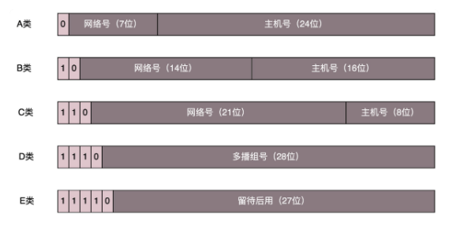

# 网络协议


## 1. 通信协议

### 网络协议构成

**应用层**： 在浏览器里面输入 https://www.kaola.com ，这是一个 URL。浏览器只知道名字是“www.kaola.com”。可以使用DNS或者HTTPDNS。无论用哪一种方法查找，最终都会得到这个地址：**106.114.138.24。这个是 IP 地址，是互联网世界的“门牌号”。** DNS、HTTP、HTTPS 所在的层我们称为应用层。


**传输层：**经过应用层封装后，浏览器会将应用层的包交给下一层去完成，通过 socket 编程来实现。下一层是传输层。传输层有两种协议，一种是无连接的协议 UDP，一种是面向连接的协议 TCP。TCP 协议里面会有两个端口，一个是浏览器监听的端口，一个是电商的服务器监听的端口。操作系统往往通过端口来判断，它得到的包应该给哪个进程。


**网络层：**传输层封装完毕后，浏览器会将包交给操作系统的网络层。网络层的协议是 IP 协议。在 IP 协议里面会有源 IP 地址，即浏览器所在机器的 IP 地址和目标 IP 地址，也即电商网站所在服务器的 IP 地址。


**链路层：**操作系统知道要离开本地去远方，去外地就要去网关。操作系统大吼一声，谁是 192.168.1.1 啊。网关会回答，**这个本地地址就是 MAC 地址，而大吼的那一声是 ARP 协议。**网关收到包之后，会根据自己的知识，判断下一步应该怎么走。**网关往往是一个路由器，到某个 IP 地址应该怎么走，这个叫作路由表。**


网关之间相互沟通，这种沟通的协议称为路由协议，**常用的有 OSPF 和 BGP**。最后一个网关知道这个网络包要去的地方就问谁是目标 IP 啊？**目标服务器就会回复一个 MAC 地址。网络包过关后，通过这个 MAC 地址就能找到目标服务器**。

目标服务器发现 MAC 地址对上了，取下 MAC 头来，发送给操作系统的网络层。发现 IP 也对上了，就取下 IP 头。IP 头里会写上一层封装的是 TCP 协议，然后将其交给传输层，即 TCP 层。


在这一层里，对于收到的每个包，**都会有一个回复的包说明收到了**。而仅仅是 TCP 层的一个说明，即收到之后的回复。当然这个回复，会沿着刚才来的方向走回去，报个平安


### 网络分层


#### 网络包接受

调用 process_layer2(buffer)，摘掉二层的头，看一看，应该根据头里面的内容做什么操作。假设你发现这个包的 MAC 地址和你的相符，那说明就是发给你的，于是需要调用 process_layer3(buffer)。

调用 process_layer3(buffer)，摘掉三层的头，看看到底是发送给自己的，还是希望自己转发出去的。如果 IP 地址不是自己的，那就应该转发出去；如果 IP 地址是自己的，那就是发给自己的。根据 IP 头里面的标示，拿掉三层的头，进行下一层的处理，到底是调用process_tcp(buffer) 呢，还是调用 process_udp(buffer) 呢

调用 process_tcp(buffer)，就需要查看四层的头，看这是一个发起，还是一个应答，又或者是一个正常的数据包，然后分别由不同的逻辑进行处理。如果是发起或者应答，接下来可能要发送一个回复包；如果是一个正常的数据包，就需要交给应用层处理


#### 网络包发送

调用 send_tcp(buffer)。不用说，Buffer 里面就是 HTTP 请求的内容。这个函数里面加一个 TCP 的头，记录下源端口号。浏览器会给你目的端口号，一般为 80 端口。

调用 send_layer3(buffer)。在这个函数里面加一个 IP 的头，记录下源 IP 的地址和目标 IP 的地址。

然后调用 send_layer2(buffer)。这个函数里面要加一下 MAC 的头，记录下源 MAC 地址，得到的就是本机器的 MAC 地址和目标的 MAC 地址。


### IP地址和MAC地址

运行一下 ip addr

```shell
root@test:~# ip addr
1: lo: <LOOPBACK,UP,LOWER_UP> mtu 65536 qdisc noqueue state UNKNOWN group default 
    link/loopback 00:00:00:00:00:00 brd 00:00:00:00:00:00
    inet 127.0.0.1/8 scope host lo
       valid_lft forever preferred_lft forever
    inet6 ::1/128 scope host 
       valid_lft forever preferred_lft forever
2: eth0: <BROADCAST,MULTICAST,UP,LOWER_UP> mtu 1500 qdisc pfifo_fast state UP group default qlen 1000
    link/ether fa:16:3e:c7:79:75 brd ff:ff:ff:ff:ff:ff
    inet 10.100.122.2/24 brd 10.100.122.255 scope global eth0
       valid_lft forever preferred_lft forever
    inet6 fe80::f816:3eff:fec7:7975/64 scope link 
       valid_lft forever preferred_lft foreverxxxxxxxxxx 08:00:27:07:e9:ae brd ff:ff:ff:ff:ffroot@test:~# ip addr1: lo: <LOOPBACK,UP,LOWER_UP> mtu 65536 qdisc noqueue state UNKNOWN group default     link/loopback 00:00:00:00:00:00 brd 00:00:00:00:00:00    inet 127.0.0.1/8 scope host lo       valid_lft forever preferred_lft forever    inet6 ::1/128 scope host        valid_lft forever preferred_lft forever2: eth0: <BROADCAST,MULTICAST,UP,LOWER_UP> mtu 1500 qdisc pfifo_fast state UP group default qlen 1000    link/ether fa:16:3e:c7:79:75 brd ff:ff:ff:ff:ff:ff    inet 10.100.122.2/24 brd 10.100.122.255 scope global eth0       valid_lft forever preferred_lft forever    inet6 fe80::f816:3eff:fec7:7975/64 scope link        valid_lft forever preferred_lft forever
```

本来 32 位的 IP 地址就不够，还被分成了 5 类。

C 类地址能包含的最大主机数量实在太少了，只有 254 个。当时设计的时候恐怕没想到，现在估计一个网吧都不够用吧。而 B 类地址能包含的最大主机数量又太多了。6 万多台机器放在一个网络下面，一般的企业基本达不到这个规模。



#### 无类型域间选路（CIDR）

于是有了一个折中的方式叫作无类型域间选路，简称 CIDR。这种方式打破了原来设计的几类地址的做法，将 32 位的 IP 地址一分为二，前面是网络号，后面是主机号。10.100.122.2/24，这个 IP 地址中有一个斜杠，斜杠后面有个数字 24。这种地址表示形式，就是 CIDR。**后面 24 的意思是，32 位中，前 24 位是网络号，后 8 位是主机号。**

一个是广播地址，10.100.122.255。如果发送这个地址，所有 10.100.122 网络里面的机器都可以收到。另一个是子网掩码，255.255.255.0。**将子网掩码和 IP 地址按位计算 AND，就可得到网络号。**

16.158.165.91/22 这个 CIDR。16.158 的部分不会动，它占了前 16 位。中间的 165，**变为二进制为‭10100101**‬。除了前面的 16 位，还剩 6 位。所以，这 8 位中前 6 位是网络号，16.158.<101001>，而 <01>.91 是机器号。

**地址范围是16.158.<101001><00>.1 至 16.158.<101001><00>.255。子网掩码是 255.255.<111111><00>.0**


#### MAC 地址

一个网络包要从一个地方传到另一个地方，除了要有确定的地址，还需要有定位功能。 而有门牌号码属性的 IP 地址，才是有远程定位功能的。

**MAC 地址更像是身份证，是一个唯一的标识。**它的唯一性设计是为了组网的时候，不同的网卡放在一个网络里面的时候，可以不用担心冲突。从硬件角度，保证不同的网卡有不同的标识。

MAC 地址的通信范围比较小，局限在一个子网里面。一旦跨子网，即从 192.168.0.2/24 到 192.168.1.2/24，MAC 地址就不行了，需要 IP 地址起作用了。


#### 网络设备的状态标识

**<BROADCAST,MULTICAST,UP,LOWER_UP> 叫做 net_device flags**，网络设备的状态标识。

+ UP 表示网卡处于启动的状态；
+ BROADCAST 表示这个网卡有广播地址，可以发送广播包；
+ MULTICAST 表示网卡可以发送多播包；
+ LOWER_UP 表示 L1 是启动的，也即网线插着呢。
+ MTU1500 是指最大传输单元 MTU 为 1500，这是以太网的默认值。


**qdisc 全称是 queueing discipline，中文叫排队规则**

+ 最简单的 qdisc 是 pfifo，它不对进入的数据包做任何的处理，数据包采用先入先出的方式通过队列。
+ pfifo_fast 稍微复杂一些，它的队列包括三个波段（band）。在每个波段里面，使用先进先出规则。三个波段（band）的优先级也不相同。band 0 的优先级最高，band 2 的最低。如果 band 0 里面有数据包，系统就不会处理 band 1 里面的数据包。


### DHCP

如果是数据中心里面的服务器，IP 一旦配置好，基本不会变，这就相当于买房自己装修。DHCP 的方式就相当于租房。你不用装修，都是帮你配置好的。你

#### 工作方式

新来的机器使用 IP 地址 0.0.0.0 发送了一个广播包，目的 IP 地址为 255.255.255.255。广播包封装了 UDP，UDP 封装了 BOOTP。其实 DHCP 是 BOOTP 的增强版，我们称为 **DHCP Discover。**


DHCP Server 的话根据MAC 地址唯一确定是新的设备，需要租给它一个 IP 地址，这个过程我们称为 **DHCP Offer**。DHCP Server 回复说，我分配了一个可用的 IP 给你


新的设备会选择其中一个 DHCP Offer，并且会向网络发送一个 DHCP Request 广播数据包，包中包含客户端的 MAC 地址、接受的租约中的 IP 地址、提供此租约的 DHCP 服务器地址等，并告诉所有 DHCP Server 它将接受哪一台服务器提供的 IP 地址。


当 DHCP Server 接收到客户机的 DHCP request 之后，会广播返回给客户机一个 DHCP ACK 消息包，表明已经接受客户机的选择，并将这一 IP 地址的合法租用信息和其他的配置信息都放入该广播包，发给客户机


#### IP 地址的收回和续租

客户机会在租期过去 50% 的时候，直接向为其提供 IP 地址的 DHCP Server 发送 DHCP request 消息包。客户机接收到该服务器回应的 DHCP ACK 消息包，会根据包中所提供的新的租期以及其他已经更新的 TCP/IP 参数，更新自己的配置


#### 预启动执行环境（PXE）

PXE 协议分为客户端和服务器端，由于还没有操作系统，**只能先把客户端放在 BIOS 里面。**当计算机启动时，BIOS 把 PXE 客户端调入内存里面，就可以连接到服务端做一些操作了。

DHCP Server 是需要配置的 next-server，指向 PXE 服务器的地址，另外要配置初始启动文件 filename。

```JSON
ddns-update-style interim;
ignore client-updates;
allow booting;
allow bootp;
subnet 192.168.1.0 netmask 255.255.255.0
{
option routers 192.168.1.1;
option subnet-mask 255.255.255.0;
option time-offset -18000;
default-lease-time 21600;
max-lease-time 43200;
range dynamic-bootp 192.168.1.240 192.168.1.250;
filename "pxelinux.0";
next-server 192.168.1.180;
}
```


启动 PXE 客户端。第一步是通过 DHCP 协议告诉 DHCP Server。DHCP Server 便租给它一个 IP 地址，同时也给它 PXE 服务器的地址、启动文件 **pxelinux.0。**


PXE 客户端知道要去 PXE 服务器下载这个文件后，就可以初始化机器。于是便开始下载，下载的时候使用的是 TFTP 协议。所以 PXE 服务器上，往往还需要有一个 TFTP 服务器。


PXE 客户端向 TFTP 服务器请求下载这个文件，TFTP 服务器就将这个文件传给它。然后，PXE 客户端收到这个文件后，就开始执行这个文件。**这个文件会指示 PXE 客户端，向 TFTP 服务器请求计算机的配置信息 pxelinux.cfg。**TFTP 服务器会给 PXE 客户端一个配置文件，里面会说内核在哪里、initramfs 在哪里。PXE 客户端会请求这些文件。

